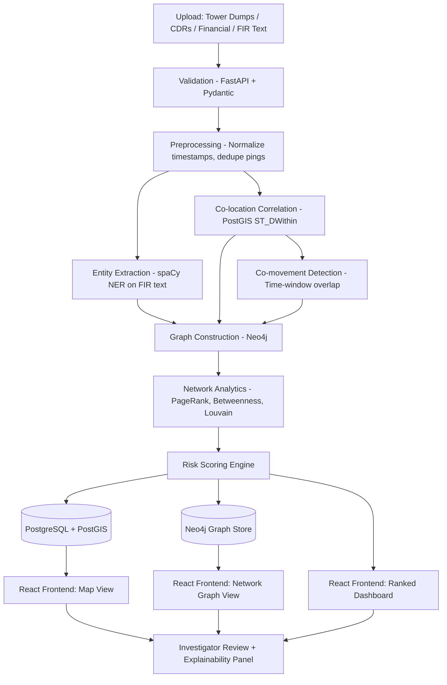
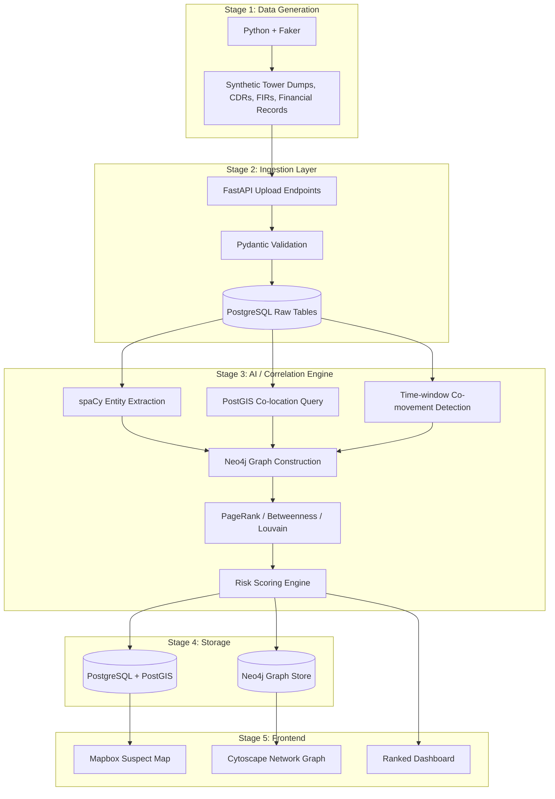
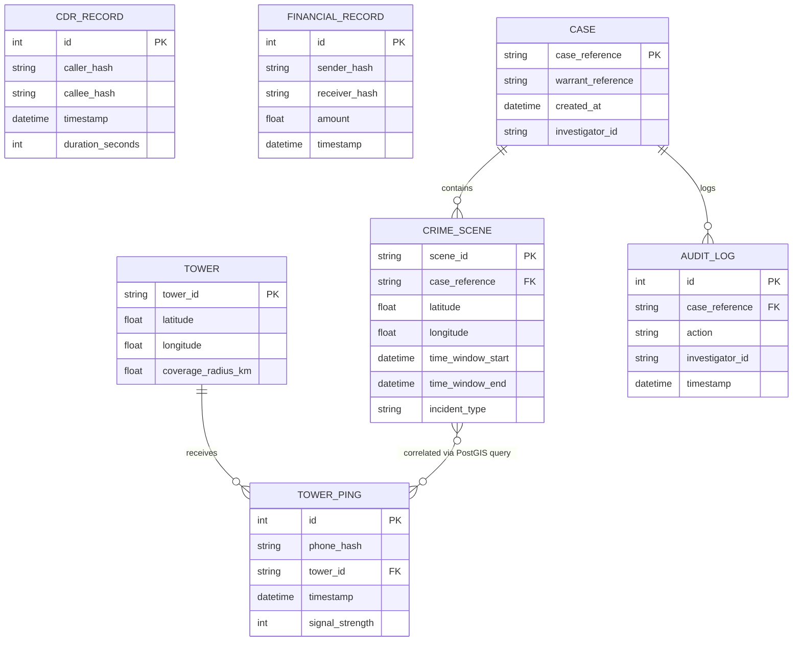

# NEXUS-CRIME
## Product Requirements Document (PRD)
### AI-Powered Criminal Network Analysis System — SIH Problem Statement 189

**Document status:** Implementation-ready
**Prepared for:** Development team, hackathon judges, future contributors
**Source of truth:** NEXUS-CRIME System Architecture & Tech Stack Report (prior document)

---

## 1. Executive Summary

NEXUS-CRIME is a geospatial-first, AI-assisted criminal network analysis platform that ingests fragmented law-enforcement data — cell tower dumps, Call Detail Records (CDRs), financial transaction records, and unstructured FIR text — and automatically constructs, scores, and visualizes criminal relationship networks.

The system's core capability is **tower dump co-location and co-movement correlation**: identifying which devices were present at multiple crime scenes, and which devices consistently travel together, then fusing this with call and transaction data into a single relationship graph. Network analytics (PageRank, Betweenness Centrality, Louvain community detection) identify likely coordinators and gang clusters, and a weighted risk-scoring engine ranks suspects for investigator review.

**Expected outcome:** A working end-to-end demo (synthetic data → correlation → graph/map visualization → ranked, explainable suspect list) deployable within a 2-day hackathon build window, architected so every component remains valid for a real government pilot without requiring a redesign.

**Major capabilities:**
- Multi-source data ingestion (tower dumps, CDRs, financial records, FIR text)
- NLP entity extraction from unstructured text
- Geospatial co-location and co-movement correlation
- Graph-based network analytics and community detection
- Explainable, evidence-cited risk scoring
- Interactive map and network graph visualization
- Full audit trail for legal defensibility

---

## 2. Vision Statement

To give every investigator the analytical reach of a full intelligence unit — turning weeks of manual spreadsheet cross-referencing into seconds of automated, explainable correlation — without ever replacing human judgment or introducing opaque, unaccountable decision-making into the justice system.

---

## 3. Problem Statement

**Current problems:**
- Law enforcement agencies collect large volumes of data (FIRs, CDRs, financial records, surveillance reports, social media intelligence, criminal history databases) across disconnected systems.
- Data is fragmented, unstructured, and distributed — no single system performs cross-source entity resolution.
- Manual link analysis (an investigator manually cross-referencing names, numbers, and locations) is slow, labor-intensive, and error-prone at scale.

**Why current approaches fail:**
- Existing systems (CCTNS, ICJS) store structured records but do not perform automated relationship discovery across sources.
- Manual analysis cannot practically scale to tower dumps containing thousands of records per crime scene.
- Human analysts miss non-obvious multi-hop connections (A knows B who transacted with C who co-located with the original suspect) that graph algorithms surface trivially.

**Why this solution exists:**
NEXUS-CRIME automates the correlation step specifically — not by replacing investigator judgment, but by doing the mechanical cross-referencing (which devices were where, when, and with whom) that is currently a manual, error-prone bottleneck, and presenting results with full source traceability so every output remains legally defensible.

---

## 4. Objectives

**Business objectives**
- Demonstrate a viable, low-cost (₹0 build cost) pilot-ready system to NCRB/state police stakeholders.
- Position the system for potential post-hackathon pilot adoption with a single state Crime Investigation Department.

**Technical objectives**
- Build a fully working, end-to-end pipeline: data generation → ingestion → correlation → graph analytics → visualization within the 2-day window.
- Keep the system deployable fully on-premise/offline (no mandatory external LLM API dependency).

**User objectives**
- Reduce the time an investigator spends manually cross-referencing tower dumps and call records across multiple crime scenes.
- Provide a single, explainable view of a suspect's relationship network instead of siloed spreadsheets.

**Measurable goals**

| Goal | Target |
|---|---|
| Correlation engine correctly recovers planted synthetic network | 100% recall on seeded demo case |
| End-to-end pipeline latency (upload → graph rendered) | Under 30 seconds for demo-scale dataset (~5,000 tower ping records) |
| Working MVP feature completion | All "Must build" items from Section 8 of the source architecture report, by end of Day 2 |

---

## 5. Success Metrics (KPIs)

| Metric | Definition | Target (Hackathon) |
|---|---|---|
| Processing latency | Time from file upload to correlation results available | < 30s for demo dataset |
| Upload success rate | % of well-formed CSV uploads that ingest without error | > 95% |
| API response time | p95 latency for dashboard/graph/map data endpoints | < 500ms |
| Graph generation time | Time to construct Neo4j graph + run PageRank/Louvain | < 10s for demo dataset |
| Investigation time reduction (narrative metric for pitch) | Manual cross-reference time vs. system time on same synthetic case | Qualitative — state the manual-equivalent time in the demo narrative |
| System accuracy (synthetic validation) | Recall/precision of the planted network recovery | 100% recall on seeded suspects; false-positive rate reported honestly |
| Scalability metric | Max tower ping records handled without query timeout in dev environment | ≥ 50,000 records (stretch validation, not required for demo) |

---

## 6. Stakeholders

| Stakeholder | Interest |
|---|---|
| Investigators (end users) | Faster, explainable link analysis on open cases |
| Supervising officers | Aggregated case oversight, audit visibility |
| NCRB / Ministry of Home Affairs | Standardized, cross-source crime intelligence tooling |
| State Crime Investigation Departments | Potential pilot adopters |
| SIH judges | Technical soundness, feasibility, ethical rigor, demo clarity |
| Development team | Build feasibility within hackathon constraints |
| Future maintainers | Long-term extensibility, code clarity, documentation completeness |
| Civil liberties / legal reviewers (implied stakeholder) | Ensuring no demographic profiling, proper legal-authorization gating |

---

## 7. Target Users

### Persona 1: Field Investigator
- **Goals:** Quickly determine whether devices present at a crime scene connect to other open cases or known associates.
- **Frustrations:** Manually cross-referencing spreadsheets across multiple data sources; missing non-obvious multi-hop links.
- **Responsibilities:** Uploads case-specific tower dumps/CDRs (with proper legal authorization), reviews flagged leads, verifies before escalation.
- **Permissions:** Access only to cases assigned to them; cannot resolve phone hashes to raw identifiers without logged authorization.
- **Workflow:** Upload data → review ranked suspect list and network graph → drill into "why flagged" evidence → escalate verified leads.

### Persona 2: Supervising Officer
- **Goals:** Oversight across multiple ongoing cases and investigator activity.
- **Frustrations:** Lack of visibility into cross-case patterns that individual investigators can't see in isolation.
- **Responsibilities:** Reviews aggregated case data, audits investigator queries.
- **Permissions:** Read access across all cases in their jurisdiction; cannot alter underlying data.
- **Workflow:** Views dashboard aggregating flagged networks across cases → identifies cross-case recurring devices → assigns follow-up.

### Persona 3: System Administrator (Future Production Persona)
- **Goals:** Maintain system uptime, manage user access, ensure compliance logging.
- **Frustrations:** N/A for hackathon scope — included for production completeness.
- **Responsibilities:** User provisioning, audit log review, data retention enforcement.
- **Permissions:** Full administrative access, no case-data visibility by default (separation of duties).
- **Workflow:** Not in hackathon MVP scope — documented for future roadmap only.

---

## 8. Product Scope

**In Scope (Hackathon MVP)**
- Synthetic data generation (tower dumps, CDRs, financial records, FIR text) with planted ground-truth network
- CSV/JSON upload and ingestion via FastAPI
- spaCy-based entity extraction from FIR text
- PostGIS-based co-location correlation
- Time-window-based co-movement detection
- Neo4j graph construction from all relationship types
- PageRank, Betweenness Centrality, Louvain community detection
- Weighted risk scoring per suspect
- Interactive Mapbox map (towers, crime scenes, flagged suspects)
- Interactive Cytoscape.js network graph
- Explainability panel citing source evidence per flagged insight
- Basic case upload/dashboard UI

**Out of Scope (Explicitly Not Built for Hackathon)**
- Real-time streaming data ingestion
- Multi-tenant production authentication/authorization system
- Integration with real CCTNS/ICJS/telecom operator systems
- GPS-precise trajectory reconstruction
- Facial recognition or any biometric matching
- Predictive/automated arrest recommendations
- Mobile app version

**Future Scope**
- CCTNS/ICJS schema adapter for real data ingestion
- Role-based multi-agency access control
- Real-time tower dump streaming pipeline
- Advanced ML-based entity resolution (beyond fuzzy matching)
- Cross-state/cross-jurisdiction case linking

---

## 9. User Stories

**US-01**
As an investigator, I want to upload tower dump CSVs for a crime scene, so that I can see which devices were present without manually filtering raw logs.
*Acceptance criteria:* Upload succeeds for well-formed CSV matching schema; malformed rows are rejected with a specific error message; successful upload triggers correlation processing automatically.

**US-02**
As an investigator, I want the system to flag devices present at more than one crime scene, so that I can identify suspects connecting multiple incidents.
*Acceptance criteria:* A device appearing in ≥2 crime-scene time/location windows is listed in the flagged suspects table with the specific scenes and timestamps cited.

**US-03**
As an investigator, I want to see which devices consistently travel together, so that I can identify likely associates rather than coincidental bystanders.
*Acceptance criteria:* Two devices co-occurring at the same tower within a configurable time window (default ±15 min) on ≥2 separate days are flagged as "co-moving," with each occurrence's tower ID and timestamp listed.

**US-04**
As an investigator, I want a visual network graph of all flagged relationships, so that I can quickly identify the most central/coordinating individual.
*Acceptance criteria:* Graph renders with node size proportional to centrality score; clicking a node reveals its connections and underlying evidence.

**US-05**
As an investigator, I want every AI-generated flag to explain its reasoning, so that I can verify it before taking any action.
*Acceptance criteria:* Every flagged node/edge has a "why" panel listing the exact source records (tower ID, timestamp, transaction ID, etc.) that produced the flag.

**US-06**
As a supervising officer, I want to see a ranked list of suspects by risk score, so that I can prioritize investigative resources.
*Acceptance criteria:* Dashboard displays suspects sorted descending by risk score, with score breakdown by contributing factor.

**US-07**
As a system, I want to require a case/warrant reference before running any tower dump correlation, so that usage remains tied to legal authorization.
*Acceptance criteria:* Upload endpoint rejects tower dump processing requests missing a case reference field; the reference is stored with the audit log entry.

**US-08**
As an investigator, I want the map to show suspect device movement over time, so that I can understand behavioral patterns.
*Acceptance criteria:* Clicking a flagged device shows its tower-ping timeline on the map with a time slider to scrub through days (stretch goal — see Section 8, MVP Scope).

---

## 10. Functional Requirements

### FR-01: Data Ingestion
- **Purpose:** Accept and validate multi-source crime data files.
- **Inputs:** CSV/JSON files (tower dumps, CDRs, financial records, FIR text)
- **Outputs:** Validated records written to PostgreSQL
- **Dependencies:** FastAPI, Pydantic (schema validation), SQLAlchemy
- **Failure cases:** Malformed schema, missing required fields, unsupported file type
- **Validation:** Schema check against expected column set per data type before write
- **Priority:** P0 (blocking — nothing downstream works without this)

### FR-02: Entity Extraction (NLP)
- **Purpose:** Extract structured entities (PERSON, LOCATION, PHONE, VEHICLE, ORG) from unstructured FIR text.
- **Inputs:** Raw FIR narrative text
- **Outputs:** Structured entity records with type and confidence score
- **Dependencies:** spaCy (`en_core_web_sm`/`trf`), custom Indian-entity gazetteer/regex
- **Failure cases:** Ambiguous/low-confidence extraction; OCR-quality text if scanned documents are used
- **Validation:** Confidence threshold filtering before entities are used downstream
- **Priority:** P1

### FR-03: Co-location Correlation
- **Purpose:** Identify devices present at multiple crime scenes.
- **Inputs:** Tower ping records, crime scene locations/time windows, tower metadata (lat/long, radius)
- **Outputs:** List of devices flagged as co-location suspects, with supporting evidence
- **Dependencies:** PostGIS `ST_DWithin`, PostgreSQL
- **Failure cases:** Missing tower metadata; ambiguous coverage radius overlap
- **Validation:** Minimum of 2 independent scene co-locations required before flagging
- **Priority:** P0

### FR-04: Co-movement Detection
- **Purpose:** Identify devices that repeatedly travel together.
- **Inputs:** Tower-sequence timelines per device
- **Outputs:** Co-movement event count and scoring per device pair
- **Dependencies:** Custom Python time-window overlap logic
- **Failure cases:** Sparse ping data leading to false negatives; single-coincidence false positives if threshold is too low
- **Validation:** Require ≥2 independent-day co-occurrences before flagging
- **Priority:** P0

### FR-05: Graph Construction
- **Purpose:** Fuse all relationship types (co-location, co-movement, calls, transactions) into a single graph.
- **Inputs:** Correlation engine outputs, CDR records, financial transaction records
- **Outputs:** Neo4j graph with typed nodes and weighted, evidence-linked edges
- **Dependencies:** Neo4j Python driver
- **Failure cases:** Duplicate node creation from unresolved entity variants
- **Validation:** Entity resolution pass (RapidFuzz) before node creation
- **Priority:** P0

### FR-06: Network Analytics
- **Purpose:** Compute centrality and community structure to identify key individuals and clusters.
- **Inputs:** Constructed graph
- **Outputs:** Per-node PageRank/Betweenness score, Louvain community assignment
- **Dependencies:** Neo4j Graph Data Science (GDS) library; NetworkX as fallback
- **Failure cases:** GDS plugin unavailable/misconfigured
- **Validation:** Fallback to NetworkX in-memory computation if Neo4j GDS call fails
- **Priority:** P0

### FR-07: Risk Scoring
- **Purpose:** Combine all signals into one interpretable score per suspect.
- **Inputs:** Centrality score, co-location count, co-movement count, call/transaction frequency
- **Outputs:** Weighted risk score (0–1 or 0–100 scale) per suspect node
- **Dependencies:** Plain Python; formula defined in Section 20 (Business Logic)
- **Failure cases:** Missing input signal (e.g., no CDR data available) — must degrade gracefully, not error
- **Validation:** Score components must each be independently inspectable in the "why" panel
- **Priority:** P0

### FR-08: Map Visualization
- **Purpose:** Display towers, crime scenes, and flagged suspects geographically.
- **Inputs:** PostGIS geometry data, correlation results
- **Outputs:** Interactive map with clickable markers/layers
- **Dependencies:** Mapbox GL JS, React
- **Failure cases:** Mapbox quota exceeded (unlikely at hackathon scale); missing coordinate data
- **Validation:** Graceful fallback marker rendering if a record lacks precise coordinates
- **Priority:** P0

### FR-09: Network Graph Visualization
- **Purpose:** Display the relationship graph interactively.
- **Inputs:** Neo4j graph query results
- **Outputs:** Rendered graph with node sizing by centrality, edge labeling by relationship type
- **Dependencies:** Cytoscape.js, React
- **Failure cases:** Large graphs causing rendering slowdown
- **Validation:** Pagination/filtering by minimum risk score if node count exceeds a rendering threshold
- **Priority:** P0

### FR-10: Explainability Panel
- **Purpose:** Show the evidentiary basis for every flag.
- **Inputs:** Edge/node metadata stored during graph construction
- **Outputs:** Human-readable citation of source records (tower ID, timestamp, transaction ID, etc.)
- **Dependencies:** Data model design in Section 18 (every edge stores source references)
- **Failure cases:** Missing source reference metadata
- **Validation:** Enforce at graph-construction time that every edge write includes source evidence
- **Priority:** P0 (core to the system's legal defensibility and ethical positioning)

---

## 11. Non-Functional Requirements

| Category | Requirement |
|---|---|
| **Performance** | Correlation pipeline completes within 30s for a ~5,000-record demo dataset |
| **Availability** | Not applicable at hackathon scale (single-instance local/demo deployment); documented as future roadmap for production HA |
| **Reliability** | Ingestion endpoint must reject malformed data without crashing the service; background correlation task failures must be logged and surfaced, not silent |
| **Scalability** | PostGIS and Neo4j both support horizontal scaling in production (documented in Section 26); hackathon build validated at single-node scale |
| **Maintainability** | Modular separation between ingestion, correlation, graph, and presentation layers (Section 14) so each can be modified independently |
| **Security** | Phone-hash-only identifiers throughout; no raw PII exposed in graph/map layers by default |
| **Privacy** | No demographic features in any scoring model; case/warrant reference required before processing |
| **Accessibility** | Dashboard UI follows basic WCAG contrast/labeling practices where feasible within hackathon timeline |
| **Usability** | Every AI output labeled as "investigative lead," never "conclusion"; explainability panel always one click away |
| **Portability** | Fully containerizable via Docker Compose (Postgres + Neo4j); frontend/backend deployable to any standard host |
| **Observability** | Structured logging on ingestion, correlation, and graph construction stages (minimum: request ID, timestamp, stage, outcome) |
| **Disaster Recovery** | Not in hackathon scope; documented as future roadmap (see Section 43) |

---

## 12. Product Features

### Feature: Tower Dump Correlation Engine
- **Description:** Core module that cross-references tower ping data against crime scene locations and time windows to surface co-location and co-movement patterns.
- **Business value:** Automates the single most labor-intensive manual investigative task described in the problem statement.
- **Technical flow:** Ingestion → PostGIS radius query per crime scene → device-set intersection across scenes → time-window overlap check for co-movement → results passed to graph construction.
- **Dependencies:** PostgreSQL/PostGIS, tower metadata availability.
- **Future improvements:** DBSCAN-based fuzzy spatiotemporal clustering to catch patterns beyond simple time-window rules (documented explicitly as a v2 enhancement, not built for hackathon, to preserve rule-based explainability now).

### Feature: Criminal Network Graph
- **Description:** Fused relationship graph across co-location, co-movement, call, and transaction data.
- **Business value:** Surfaces the "key individual" (coordinator) that simple frequency counts would miss.
- **Technical flow:** Correlation outputs + CDR/transaction data → Neo4j node/edge construction → PageRank/Betweenness/Louvain via GDS.
- **Dependencies:** Neo4j, entity resolution accuracy.
- **Future improvements:** Temporal graph analysis (how the network evolves over time, not just a static snapshot).

### Feature: Interactive Suspect Map
- **Description:** Geographic visualization of towers, crime scenes, and flagged devices.
- **Business value:** Gives investigators spatial intuition that a table of coordinates cannot.
- **Technical flow:** PostGIS geometry data → React/Mapbox rendering.
- **Dependencies:** Mapbox GL JS free tier.
- **Future improvements:** Heatmap layer for ping density (documented as stretch goal).

### Feature: Explainable Risk Scoring
- **Description:** Weighted, per-suspect score combining all correlation signals.
- **Business value:** Converts raw graph metrics into an investigator-prioritizable ranked list, while remaining fully auditable.
- **Technical flow:** See Section 20 (Business Logic) for exact formula.
- **Dependencies:** All upstream correlation and graph modules.
- **Future improvements:** Configurable weight tuning per case type (e.g., financial-crime cases might weight transaction signals higher).

---

## 13. End-to-End Workflow

1. **Upload:** Investigator (or synthetic generator, for demo) submits tower dump, CDR, financial, and/or FIR text files via FastAPI endpoints, with a required case/warrant reference.
2. **Validation:** FastAPI validates file schema via Pydantic; malformed records are rejected with specific error messages; valid records proceed.
3. **Preprocessing:** Timestamps normalized to UTC; duplicate/near-duplicate pings within short intervals collapsed into presence intervals; tower IDs joined to geographic coordinates via PostGIS.
4. **AI/Correlation:**
   - spaCy extracts entities from any FIR text.
   - PostGIS radius queries identify devices present at each crime scene.
   - Cross-scene intersection flags co-location suspects.
   - Time-window overlap analysis flags co-movement pairs.
5. **Graph Creation:** All relationship types (co-location, co-movement, calls, transactions) become typed, evidence-linked edges in Neo4j.
6. **Analytics:** PageRank/Betweenness Centrality and Louvain community detection run via Neo4j GDS.
7. **Scoring:** Weighted risk score computed per suspect node from all available signals.
8. **Storage:** Raw/geo data persists in PostgreSQL+PostGIS; relationship data persists in Neo4j.
9. **Visualization:** React frontend queries both stores to render the map (Mapbox), network graph (Cytoscape.js), and ranked dashboard.
10. **Investigation:** Investigator reviews ranked suspects, drills into the explainability panel for source evidence, and makes an independent decision on escalation — the system never auto-escalates or auto-concludes.



---

## 14. Module Breakdown

### Frontend Module
- **Responsibilities:** Render map, graph, dashboard; handle case upload UI; display explainability panels.
- **Inputs:** REST API responses from backend.
- **Outputs:** Rendered UI, user interaction events (clicks, uploads).
- **Dependencies:** React, Vite, Tailwind, Mapbox GL JS, Cytoscape.js, Recharts, Axios, Zustand.
- **Interfaces:** REST calls to FastAPI backend.

### Backend Module (API Layer)
- **Responsibilities:** Expose upload, query, and dashboard endpoints; orchestrate correlation pipeline.
- **Inputs:** HTTP requests (file uploads, query params).
- **Outputs:** JSON responses; triggers background correlation tasks.
- **Dependencies:** FastAPI, Uvicorn, Pydantic, SQLAlchemy, GeoAlchemy2.
- **Interfaces:** PostgreSQL, Neo4j drivers; REST API to frontend.

### AI Engine Module
- **Responsibilities:** Entity extraction, co-location/co-movement correlation, risk scoring.
- **Inputs:** Validated records from backend.
- **Outputs:** Structured entities, correlation results, risk scores.
- **Dependencies:** spaCy, RapidFuzz, scikit-learn, custom Python logic.
- **Interfaces:** Called internally by backend as background tasks; writes results to Postgres/Neo4j.

### Database Layer (Geo Engine)
- **Responsibilities:** Store raw records; execute geospatial queries.
- **Inputs:** Validated records; spatial queries from AI engine.
- **Outputs:** Query results (device sets per crime scene, etc.).
- **Dependencies:** PostgreSQL + PostGIS.
- **Interfaces:** SQLAlchemy/GeoAlchemy2 from backend.

### Graph Engine Module
- **Responsibilities:** Store relationship graph; execute analytics.
- **Inputs:** Node/edge write requests from AI engine.
- **Outputs:** Graph query results, centrality/community scores.
- **Dependencies:** Neo4j Community Edition/AuraDB, GDS library.
- **Interfaces:** Neo4j Python driver, Cypher queries.

### Authentication Module (Future/Minimal for Hackathon)
- **Responsibilities:** Case/warrant reference logging at minimum for MVP; full RBAC deferred to future scope.
- **Inputs:** Case reference field on upload.
- **Outputs:** Audit log entry.
- **Dependencies:** python-jose, bcrypt (available but full auth flow is future scope).
- **Interfaces:** Middleware on upload endpoints.

### Dashboard Module
- **Responsibilities:** Present ranked suspect list, risk score breakdowns, case stats.
- **Inputs:** Risk scoring engine output.
- **Outputs:** Rendered dashboard widgets.
- **Dependencies:** React, Recharts.
- **Interfaces:** REST API.

### Analytics Module
- **Responsibilities:** PageRank, Betweenness, Louvain computation.
- **Inputs:** Graph structure.
- **Outputs:** Per-node scores/community IDs.
- **Dependencies:** Neo4j GDS, NetworkX fallback.
- **Interfaces:** Called by AI engine post graph-construction.

### Monitoring Module (Minimal for Hackathon)
- **Responsibilities:** Structured logging on each pipeline stage.
- **Inputs:** Stage execution events.
- **Outputs:** Log entries (console/file for hackathon; production would use a log aggregator).
- **Dependencies:** Python `logging` module.
- **Interfaces:** Cross-cutting, called from every backend module.

### Deployment Module
- **Responsibilities:** Containerize and run all services.
- **Inputs:** Docker Compose configuration.
- **Outputs:** Running Postgres, Neo4j, backend, frontend services.
- **Dependencies:** Docker, Docker Compose.
- **Interfaces:** N/A (infrastructure layer).

### Testing Module
- **Responsibilities:** Validate correlation logic against known synthetic ground truth.
- **Inputs:** Synthetic dataset with planted network.
- **Outputs:** Pass/fail on recall of planted suspects.
- **Dependencies:** pytest (recommended, not yet in stack list — add for hackathon if time permits).
- **Interfaces:** Runs against backend correlation functions directly.

---

## 15. System Architecture



**Component interactions:** The frontend never writes directly to either database — all writes flow through FastAPI, which enforces validation and audit logging. Both databases are read independently by the frontend via dedicated backend query endpoints (no direct DB access from the client).

**Request flow:** Client → FastAPI → (PostgreSQL and/or Neo4j) → FastAPI → Client (JSON). Correlation runs as a background task triggered post-upload, decoupling the (potentially slower) AI pipeline from the immediate upload response.

**Data flow:** Raw files → validated relational/geometry records → extracted entities and correlation results → graph nodes/edges → scored, ranked output → visualized.

**Synchronization:** PostgreSQL and Neo4j are kept consistent by writing both from the same backend transaction boundary during graph construction (the AI engine writes correlation evidence to Postgres and corresponding edges to Neo4j in the same request lifecycle, with a rollback-on-failure convention for the hackathon build — full two-phase commit is out of scope).

**Communication protocol:** REST/JSON between frontend and backend; native Bolt protocol between backend and Neo4j; native PostgreSQL wire protocol via SQLAlchemy/psycopg2.

---

## 16. API Specification

### `POST /upload/tower-dump`
- **Description:** Upload a tower dump CSV for a given case.
- **Headers:** `Content-Type: multipart/form-data`
- **Authentication:** Case/warrant reference required in form field (full auth deferred to future scope)
- **Request Schema:**
  ```json
  {
    "case_reference": "string (required)",
    "file": "CSV file: phone_hash, tower_id, timestamp, signal_strength"
  }
  ```
- **Response Schema:**
  ```json
  {
    "status": "accepted",
    "records_ingested": 4213,
    "records_rejected": 12,
    "job_id": "uuid"
  }
  ```
- **Status Codes:** `202 Accepted`, `400 Bad Request` (schema mismatch), `422 Unprocessable Entity` (missing case reference)
- **Validation Rules:** All four columns required; `timestamp` must be ISO 8601; `tower_id` must exist in tower metadata table
- **Example Request:** `curl -F "case_reference=CASE-2026-114" -F "file=@tower_dump.csv" http://localhost:8000/upload/tower-dump`
- **Possible Errors:** `MISSING_CASE_REFERENCE`, `INVALID_SCHEMA`, `UNKNOWN_TOWER_ID`

### `POST /upload/cdr`
- Same structure as above, schema: `caller_hash, callee_hash, timestamp, duration`

### `POST /upload/financial`
- Same structure as above, schema: `sender_hash, receiver_hash, amount, timestamp`

### `POST /upload/fir-text`
- **Request Schema:** `{ "case_reference": "string", "text": "string" }`
- **Response Schema:** `{ "entities_extracted": [...], "job_id": "uuid" }`

### `GET /cases/{case_id}/suspects`
- **Description:** Retrieve ranked suspect list with risk scores for a case.
- **Response Schema:**
  ```json
  {
    "suspects": [
      {
        "device_hash": "string",
        "risk_score": 0.87,
        "score_breakdown": {
          "centrality": 0.3,
          "colocation_count": 3,
          "comovement_count": 5,
          "call_frequency": 12
        },
        "flagged_scenes": ["scene_1", "scene_3"]
      }
    ]
  }
  ```
- **Status Codes:** `200 OK`, `404 Not Found` (case doesn't exist)

### `GET /cases/{case_id}/graph`
- **Description:** Retrieve graph structure (nodes/edges) for network visualization.
- **Response Schema:**
  ```json
  {
    "nodes": [{"id": "device_hash", "risk_score": 0.87, "community": 2}],
    "edges": [{"source": "hash1", "target": "hash2", "type": "CO_LOCATED_AT", "weight": 3, "evidence": [...]}]
  }
  ```

### `GET /cases/{case_id}/map-data`
- **Description:** Retrieve tower, crime scene, and suspect coordinates for map rendering.
- **Response Schema:**
  ```json
  {
    "towers": [{"tower_id": "T-114", "lat": 28.61, "lng": 77.20}],
    "crime_scenes": [{"id": "scene_1", "lat": 28.62, "lng": 77.21, "incident_type": "string", "date": "2026-08-01"}],
    "flagged_devices": [{"device_hash": "string", "risk_score": 0.87}]
  }
  ```

### `GET /suspects/{device_hash}/evidence`
- **Description:** Retrieve the explainability panel data for a specific flagged suspect.
- **Response Schema:**
  ```json
  {
    "device_hash": "string",
    "evidence": [
      {"type": "CO_LOCATED_AT", "tower_id": "T-114", "timestamp": "2026-08-01T14:32:00Z", "scene_id": "scene_1"}
    ]
  }
  ```

---

## 17. Database Design



**Indexes:**
- `TOWER_PING(phone_hash)` — fast lookup per device
- `TOWER_PING(timestamp)` — fast time-window filtering
- `CRIME_SCENE` geometry column — GiST spatial index (PostGIS default) for `ST_DWithin` performance
- `CDR_RECORD(caller_hash, callee_hash)` composite index

**Relationships/Constraints:**
- `CRIME_SCENE.case_reference` → `CASE.case_reference` (foreign key)
- `TOWER_PING.tower_id` → `TOWER.tower_id` (foreign key)
- `AUDIT_LOG.case_reference` → `CASE.case_reference` (foreign key)

**Optimization strategy:** Spatial GiST index on all geometry columns is non-negotiable for `ST_DWithin` performance at scale; time-based partitioning of `TOWER_PING` is recommended for production (documented in Section 26, out of scope for hackathon).

**Neo4j Graph Schema (not relational, documented separately):**
- Node labels: `Device`, `Person` (optional, resolved), `Location`
- Relationship types: `CO_LOCATED_AT` (properties: `weight`, `scene_ids`), `CO_MOVED_WITH` (properties: `weight`, `event_timestamps`), `CALLED` (properties: `count`, `total_duration`), `TRANSACTED_WITH` (properties: `count`, `total_amount`)

---

## 18. Data Models

### Device
| Attribute | Type | Validation | Example |
|---|---|---|---|
| `phone_hash` | string | SHA-256 hash format | `a1b2c3...` |
| `risk_score` | float | 0.0–1.0 | `0.87` |
| `community_id` | int | Assigned post-Louvain | `2` |

### CrimeScene
| Attribute | Type | Validation | Example |
|---|---|---|---|
| `scene_id` | string | Unique | `scene_1` |
| `latitude` | float | -90 to 90 | `28.6139` |
| `longitude` | float | -180 to 180 | `77.2090` |
| `time_window_start` | datetime | ISO 8601 | `2026-08-01T14:00:00Z` |
| `time_window_end` | datetime | ISO 8601, > start | `2026-08-01T15:00:00Z` |
| `incident_type` | string | Enum (configurable) | `"robbery"` |

### TowerPing
| Attribute | Type | Validation | Example |
|---|---|---|---|
| `phone_hash` | string | Required | `a1b2c3...` |
| `tower_id` | string | Must exist in Tower table | `T-114` |
| `timestamp` | datetime | ISO 8601 | `2026-08-01T14:32:00Z` |
| `signal_strength` | int | Typically -110 to -50 dBm range | `-78` |

### RelationshipEdge (Neo4j)
| Attribute | Type | Validation | Example |
|---|---|---|---|
| `type` | enum | `CO_LOCATED_AT`, `CO_MOVED_WITH`, `CALLED`, `TRANSACTED_WITH` | `CO_LOCATED_AT` |
| `weight` | int | Count of occurrences | `3` |
| `evidence` | array | Must be non-empty for any scored edge | `[{tower_id, timestamp, scene_id}]` |

---

## 19. AI / Analytics Pipeline

- **Preprocessing:** Timestamp normalization to UTC; deduplication of repeated pings within short intervals into presence intervals.
- **Entity extraction:** spaCy NER on FIR text, augmented with regex for structured formats (phone numbers, vehicle plates) and an Indian-name gazetteer for improved recall on local naming conventions.
- **Graph generation:** All relationship types fused into Neo4j; entity resolution (RapidFuzz fuzzy matching) merges variant references to the same real-world entity before node creation, with a human-review queue for ambiguous (70–90% confidence) matches.
- **Risk scoring:** Weighted linear combination of centrality, co-location count, co-movement count, and call/transaction frequency (exact formula in Section 20).
- **Anomaly detection:** Isolation Forest (scikit-learn) flags statistically unusual spikes in call/transaction frequency between two nodes, as a secondary signal feeding into risk scoring or standalone alerting.
- **Explainability:** Every scored node/edge retains its source evidence (tower ID, timestamp, transaction ID) at write time — explainability is not reconstructed after the fact, it is a first-class part of the data model (Section 18).
- **Confidence scoring:** Entity resolution and NER outputs carry confidence scores; only entities/matches above threshold participate in graph construction, with sub-threshold matches routed to a human-review state rather than silently dropped or silently accepted.
- **Limitations (to be stated explicitly to judges, not hidden):**
  - Tower-based location is approximate (cell-level, not GPS-precise).
  - Synthetic data validation proves the algorithm recovers a *known* planted network; real-world unlabeled data will require field validation before operational trust.
  - Fuzzy entity resolution can produce false merges at ambiguous confidence levels — mitigated by the human-review queue, not eliminated.

---

## 20. Business Logic

### Risk Scoring Formula
**Inputs:** `centrality_normalized` (0–1, from PageRank/Betweenness), `colocation_count` (integer), `comovement_count` (integer), `call_frequency_with_flagged` (integer, normalized to 0–1 via min-max scaling within the case's dataset)

**Decision rule:**
```
risk_score = (0.30 × centrality_normalized)
           + (0.25 × min(colocation_count / 5, 1.0))
           + (0.25 × min(comovement_count / 5, 1.0))
           + (0.20 × call_frequency_with_flagged_normalized)
```
(Normalization caps at 5 occurrences to prevent a single outlier count from dominating the score — documented as a tunable constant, not a hardcoded assumption.)

**Fallback behavior:** If a signal is entirely unavailable for a case (e.g., no CDR data uploaded), that term is excluded and the remaining weights are re-normalized proportionally so the score remains on a comparable 0–1 scale rather than artificially capping out low.

### Co-location Flagging Rule
**Inputs:** Set of `(device, scene)` pairs per crime scene query
**Decision rule:** A device is flagged as a co-location suspect if and only if it appears in the device sets of **2 or more distinct crime scenes** for the same case.
**Fallback behavior:** Single-scene presence is retained in the data model (visible on request) but not surfaced as a "flag" in the default suspect list, to avoid overwhelming investigators with bystander noise.

### Co-movement Flagging Rule
**Inputs:** Tower-sequence timelines for a device pair
**Decision rule:** Two devices are flagged as "co-moving" if they appear at the same tower within a ±15-minute window on **2 or more distinct calendar days**.
**Fallback behavior:** A single same-day, same-window occurrence is logged as weak evidence but does not independently trigger a flag.

---

## 21. Technology Stack

| Category | Technologies |
|---|---|
| **Frontend** | React, Vite, Tailwind CSS, Mapbox GL JS, Cytoscape.js, Recharts, Zustand, Axios |
| **Backend** | Python 3.12, FastAPI, Uvicorn, Pydantic, SQLAlchemy, GeoAlchemy2, psycopg2/asyncpg |
| **Databases** | PostgreSQL + PostGIS, Neo4j Community Edition (or AuraDB Free) |
| **Infrastructure** | Docker, Docker Compose |
| **AI/ML** | spaCy, RapidFuzz, scikit-learn, NetworkX (fallback), Neo4j Graph Data Science library |
| **Testing** | pytest (recommended addition), manual synthetic ground-truth validation |
| **Deployment** | Render/Railway (backend), Vercel/Netlify (frontend) — optional for live demo link |
| **Dev Tools** | VS Code, Postman/Thunder Client, Neo4j Browser, pgAdmin/DBeaver, Git |
| **Libraries (data generation)** | Faker, pandas |

---

## 22. Third Party Services

| Service | Purpose | Usage | Limits | Fallback | Failure Handling |
|---|---|---|---|---|---|
| Mapbox GL JS | Map tiles/rendering | Frontend map layer | 50,000 free loads/month | OpenStreetMap tiles via Leaflet | Display cached/static map view with error banner |
| OpenStreetMap Nominatim | Backup geocoding | Address lookups if needed | 1 req/sec rate limit | Manual coordinate entry | Queue and retry with backoff |
| Neo4j AuraDB Free | Optional cloud graph DB | Backup if local Docker Neo4j fails | 1 free instance, limited size | Local Neo4j via Docker | Switch connection string to local instance |
| Supabase | Optional cloud Postgres | Backup if local Docker Postgres fails | 500MB free tier | Local PostgreSQL via Docker | Switch connection string to local instance |
| Render/Railway | Backend hosting for live demo | Optional, not required for local judged demo | Free tier may sleep on inactivity | Run locally during actual judging | N/A — treat as optional convenience only |

**Note:** No external LLM API is used anywhere in this pipeline — this is an explicit design decision preserved from the source architecture document to keep the system offline-capable and free of per-request API costs or rate limits during the live demo.

---

## 23. Security

- **Authentication:** Minimal for hackathon — case/warrant reference required per upload, logged to `AUDIT_LOG`. Full user authentication (JWT via python-jose, bcrypt password hashing) is available in the stack but implementation is deferred to production scope unless time permits.
- **Authorization:** Not implemented as RBAC in hackathon MVP; documented as P0 for production (Section 43).
- **Encryption:** Phone numbers/IMSI hashed (SHA-256) before entering the pipeline — raw identifiers never stored in the demo dataset.
- **Input validation:** Pydantic schema validation on all upload endpoints; PostGIS geometry validation on coordinate inputs.
- **API protection:** Rate limiting not implemented for hackathon (single-user demo context); documented as production requirement.
- **OWASP concerns:** SQL injection mitigated via SQLAlchemy parameterized queries; Cypher injection mitigated via Neo4j driver parameterized queries (never string-concatenate user input into Cypher).
- **Secrets:** Database credentials and Mapbox API key stored in environment variables (`.env`, excluded from Git via `.gitignore`), never hardcoded.
- **Logging:** Structured logs for every ingestion, correlation, and graph-write event.
- **Audit trails:** `AUDIT_LOG` table records every case query and data merge decision with investigator ID and timestamp (mocked investigator ID acceptable for hackathon demo).

---

## 24. Privacy

- **Data ownership:** All uploaded data is treated as case-specific and scoped to the `case_reference`; no cross-case data sharing without explicit query.
- **Data retention:** Synthetic hackathon data purged after the demo session; production deployment would align with DPDP Act 2023 and DoT tower-dump retention rules (not implemented, documented as compliance requirement).
- **PII handling:** Phone/IMSI identifiers are hashed throughout the pipeline; raw identifier resolution is explicitly out of scope for the hackathon build and would require a separate, tightly access-controlled resolution service in production.
- **Government deployment considerations:** Legal authorization (case/warrant reference) is a hard gate on the upload endpoint, not an optional field — this reflects the real legal requirement for tower dump usage in India (Section 92 CrPC/BNSS equivalent).
- **Offline mode:** The entire pipeline (spaCy, PostGIS, Neo4j GDS) runs without any mandatory internet-dependent AI service, supporting fully on-premise, air-gapped deployment for sensitive law-enforcement environments — this is a deliberate architectural choice, not an afterthought.

---

## 25. Performance

- **Expected throughput:** Demo-scale dataset (~5,000 tower pings, ~500 CDR records) processed end-to-end in under 30 seconds on a standard development laptop.
- **Expected latency:** API p95 under 500ms for dashboard/graph/map query endpoints (excluding the background correlation job itself, which runs asynchronously).
- **Caching:** Redis (optional) can cache repeated map/graph queries for a given case if time permits; not required for MVP given hackathon-scale data volume.
- **Parallelism:** FastAPI's async request handling allows concurrent map/graph/dashboard queries without blocking; correlation runs as a background task so upload response is immediate.
- **Optimization opportunities (documented, not required for hackathon):** Spatial index tuning on `TOWER_PING`, batched Neo4j writes instead of per-edge writes, precomputed centrality caching for large graphs.

---

## 26. Scalability

- **Horizontal scaling:** Both PostgreSQL (via read replicas) and Neo4j (via causal clustering in Enterprise Edition, or sharding strategies) support horizontal scaling in production; not exercised at hackathon scale.
- **Vertical scaling:** Sufficient for hackathon and early pilot scale on a single reasonably provisioned server/VM.
- **Database scaling:** Time-based partitioning of `TOWER_PING` recommended once record counts move into the millions (real tower dumps can be large); PostGIS spatial indexing already accounts for the primary query pattern.
- **Future cloud migration:** Documented as compatible with a lift-and-shift to Neo4j AuraDB (paid tier) and managed PostgreSQL (e.g., Supabase paid tier or cloud-provider managed Postgres) without architectural changes, since the local Docker setup mirrors the same connection interfaces.

---

## 27. Reliability

- **Retries:** Background correlation task should implement a basic retry-on-transient-failure pattern (e.g., temporary DB connection drop) — not required for hackathon demo stability but documented as good practice.
- **Circuit breakers:** Not implemented at hackathon scale; documented as production requirement if external services (Mapbox, cloud DB fallbacks) are added.
- **Recovery:** Manual restart of Docker Compose services is sufficient recovery mechanism for hackathon demo environment.
- **Health checks:** Basic `/health` endpoint on FastAPI recommended to confirm DB connectivity before demo starts.
- **Monitoring:** Console/file-based structured logs sufficient for hackathon; production would integrate a log aggregator (documented in Section 43).

---

## 28. Error Handling

| Module | Possible Failures | Recovery | Fallback | User Messaging | Logging |
|---|---|---|---|---|---|
| Ingestion | Malformed CSV, missing case reference | Reject with specific error | N/A | Clear error message naming the failed field/row | Log rejected row count and reason |
| Entity Extraction | Low-confidence/ambiguous NER output | Route to human-review state | Proceed without that entity | Flag as "unresolved entity" in UI | Log confidence score |
| Correlation | Missing tower metadata | Skip that tower's pings, log warning | Partial correlation results still returned | Note "N towers missing metadata" in results panel | Log missing tower IDs |
| Graph Construction | Duplicate/conflicting entity resolution | Route ambiguous merges (70–90% confidence) to review queue | Keep as separate nodes until reviewed | Show "pending review" badge | Log merge decision and confidence score |
| Network Analytics | Neo4j GDS plugin unavailable | Fallback to NetworkX in-memory computation | Slightly reduced feature set (no Cypher-native queries) | N/A (transparent to user) | Log fallback activation |
| Frontend | API timeout/error | Retry once, then show error state | Cached last-known-good data if available | "Unable to load data, retrying..." | Log failed request details |

---

## 29. Edge Cases

- A device pings a tower exactly at the boundary of a crime scene's time window (off-by-one-second edge) — resolved by inclusive boundary handling in the PostGIS/time-window query.
- Two crime scenes are geographically close enough that their tower coverage radii overlap even without a real connection — mitigated by requiring the *combination* of location AND time-window match, not location alone.
- A device with very sparse ping data (e.g., phone often off) produces a false negative on co-movement detection — documented as a known limitation, not silently hidden.
- An investigator uploads the same tower dump file twice — ingestion should detect and reject exact duplicate records (based on `phone_hash + tower_id + timestamp` composite) to avoid double-counting in correlation.
- A crime scene has zero declared coverage radius or malformed coordinates — validation at upload rejects the record rather than silently producing an empty/incorrect correlation result.
- Entity resolution fuzzy-matches two genuinely different people with similar names (e.g., common Indian surnames) — mitigated by the human-review queue at 70–90% confidence, but acknowledged as an inherent risk of fuzzy matching at any confidence threshold below 100%.

---

## 30. UX Principles

- **Navigation:** Single-page dashboard with tabbed views (Map / Graph / Ranked List) rather than separate pages, to keep investigator context intact during a case review session.
- **Layout:** Map and graph views are full-width/full-height for spatial clarity; dashboard list view uses a persistent sidebar for case metadata.
- **Dashboard:** Ranked suspect list is the default landing view after a case loads — this is the primary actionable output, and the map/graph are supporting exploration tools.
- **Graph interaction:** Click-to-expand node details; hover shows quick-glance risk score; zoom/pan standard Cytoscape.js interactions.
- **Maps:** Layer toggles for towers/crime scenes/suspects so the view doesn't become visually overwhelming with all data types shown at once by default.
- **Responsiveness:** Desktop-first design (this is an investigator workstation tool, not a mobile-first consumer app) — documented explicitly as a scope decision.
- **Loading states:** Skeleton loaders on dashboard widgets while correlation background task is still running; explicit "processing..." indicator tied to job status polling.
- **Error states:** Non-blocking error banners (e.g., "3 towers missing metadata — results may be incomplete") rather than hard failures, wherever partial results remain useful.

---

## 31. UI Specifications

### Screen: Case Upload
- **Purpose:** Allow investigator to submit case data files.
- **Components:** Case reference input (required), file upload drop-zones per data type (tower dump / CDR / financial / FIR text), submit button.
- **Interactions:** Drag-and-drop or click-to-browse file selection; submit triggers upload + shows job status.
- **Empty states:** Prompt text guiding which file types are supported per drop-zone.
- **Loading:** Progress indicator during upload and while background correlation runs.
- **Validation:** Inline error messages for missing case reference or malformed file before submission is allowed.

### Screen: Case Dashboard (Ranked Suspect List)
- **Purpose:** Primary investigator view — ranked, actionable suspect list.
- **Components:** Sortable/filterable table (device hash, risk score, flagged scenes, score breakdown), tab navigation to Map/Graph views.
- **Interactions:** Click a row to open the explainability panel; sort by risk score/co-location count.
- **Empty states:** "No suspects flagged yet — correlation still processing" or "No cross-scene matches found" if genuinely empty.
- **Loading:** Skeleton table rows while data loads.
- **Validation:** N/A (read-only view).

### Screen: Map View
- **Purpose:** Geographic exploration of towers, crime scenes, and flagged devices.
- **Components:** Mapbox canvas, layer toggle controls, device timeline panel (on device click).
- **Interactions:** Click marker for details; toggle layers; (stretch) time slider to scrub device movement.
- **Empty states:** "No geo data available for this case" if crime scenes/towers are missing.
- **Loading:** Map skeleton/spinner while geo data loads.

### Screen: Network Graph View
- **Purpose:** Visual relationship exploration.
- **Components:** Cytoscape canvas, node detail sidebar (on click), legend for edge types.
- **Interactions:** Zoom/pan, click node for evidence panel, filter by minimum risk score.
- **Empty states:** "Graph will appear once correlation completes."
- **Loading:** Graph skeleton while Neo4j query resolves.

### Screen: Explainability Panel (Modal/Sidebar)
- **Purpose:** Show source evidence for any flagged node/edge.
- **Components:** List of cited source records (tower ID, timestamp, scene ID, or transaction ID) with human-readable descriptions.
- **Interactions:** Close panel, click a cited record to highlight it on the map/graph.
- **Empty states:** Should never be empty by design (Section 10, FR-10 enforces evidence at write time); if empty, treat as a bug, not a valid state.

---

## 32. Dashboard Specification

| Widget | Purpose | Data Source | Refresh Strategy | Visualization Type |
|---|---|---|---|---|
| Ranked Suspect Table | Primary prioritization view | `/cases/{id}/suspects` | On case load; manual refresh button | Sortable table |
| Risk Score Breakdown | Explain composition of a suspect's score | Same endpoint, per-row expansion | Loaded with parent table | Stacked bar or simple breakdown list |
| Case Stats Summary | Quick counts (total devices, flagged count, scenes) | Aggregated from suspects + case metadata | On case load | Stat cards |
| Community Cluster View | Show gang/group clusters | `/cases/{id}/graph` (community_id field) | On graph load | Color-coded grouping within Cytoscape or a separate small-multiples view |

---

## 33. Testing Strategy

- **Unit Testing:** Test individual correlation functions (co-location matching, co-movement scoring, risk formula) against known small synthetic inputs with hand-computed expected outputs.
- **Integration Testing:** Test the full ingestion → correlation → graph-write pipeline against the synthetic dataset with the planted ground-truth network; assert 100% recall on planted suspects.
- **API Testing:** Postman/Thunder Client collection covering every endpoint in Section 16, including malformed-input error cases.
- **Load Testing:** Not a hackathon priority; documented as future scope (Section 43) using a tool like Locust against the ingestion endpoint at higher record volumes.
- **Performance Testing:** Manual timing of the end-to-end pipeline against the demo dataset to validate the <30s KPI (Section 5).
- **Security Testing:** Manual review confirming no raw phone numbers appear in API responses or logs; confirm SQL/Cypher parameterization is used everywhere.
- **End-to-End Testing:** Full manual walkthrough of the demo script (upload → correlation → map/graph → explainability) before the actual judging session, at least twice.
- **User Acceptance Testing:** Have a team member unfamiliar with the internals attempt to interpret the dashboard/graph output without additional explanation, to validate the UX is actually legible to a fresh viewer (proxy for an investigator's first impression).

---

## 34. DevOps

- **CI/CD:** Not required for hackathon; a simple GitHub Actions workflow running `pytest` on push is a reasonable stretch goal if time permits.
- **Environment Variables:** `.env` file for DB connection strings, Mapbox API key, Neo4j credentials — never committed to Git.
- **Containers:** Backend and both databases containerized; frontend can run via `npm run dev` locally or also be containerized for consistency.
- **Docker:** `docker-compose.yml` (as specified in the source architecture report) brings up PostgreSQL+PostGIS and Neo4j with GDS plugin enabled in one command.
- **Deployment Strategy:** Local-first for the judged demo (eliminates network dependency risk during judging); optional Render/Vercel deployment as a shareable link for pre/post-event access.
- **Rollback Strategy:** For hackathon scope, rollback means `git revert` plus `docker-compose down && docker-compose up` — no blue-green or canary deployment needed at this scale.

---

## 35. Monitoring & Logging

- **Metrics:** Correlation job duration, ingestion success/failure counts, API response times — logged, not yet dashboarded, for hackathon scope.
- **Logs:** Structured (JSON-formatted, if time permits) logs at each pipeline stage: ingestion, entity extraction, correlation, graph write, scoring.
- **Alerts:** Not implemented for hackathon; documented as production requirement (e.g., alert on ingestion failure rate spike).
- **Tracing:** Not implemented for hackathon; a request ID passed through each pipeline stage's log lines is a lightweight substitute for full distributed tracing.
- **Dashboard monitoring:** N/A for hackathon — the product dashboard (Section 32) is for investigators, not system operators; an operator-facing monitoring dashboard is future scope.

---

## 36. Analytics

Product usage analytics (e.g., which views investigators spend the most time on, which suspects get escalated vs. dismissed) are not implemented for the hackathon build, since there is no real multi-session user base yet. This is documented as a natural post-pilot addition once the system has real investigator usage to learn from — premature analytics instrumentation would add build time without demo value.

---

## 37. Risks

| Category | Risk | Mitigation |
|---|---|---|
| Technical | Neo4j GDS plugin fails to install/configure correctly under time pressure | NetworkX fallback for centrality/community detection, documented in Section 6/FR-06 |
| Technical | PostGIS extension not enabled correctly in local Postgres | Use the `postgis/postgis` Docker image directly (has it pre-installed), avoid manual extension setup |
| Operational | Running out of build time before all "Must build" MVP items are complete | Strict adherence to MVP scope (Section 8); explicitly deprioritize "Stretch" items first |
| Product | Judges perceive the system as a surveillance tool despite mitigations | Proactively lead with the ethics/legal-authorization framing in the demo script (already defined in the source architecture report, Section 9) |
| Security | Demo accidentally exposes a hardcoded API key or credential | `.env` + `.gitignore` discipline enforced from Day 1, not retrofitted |
| Hackathon | Live demo fails due to a dependency (e.g., Mapbox quota, network issue) | Rehearse fully offline-capable fallback: local Docker services + cached map tiles if possible, or a pre-recorded backup clip of the working demo |
| Deployment | Team unfamiliar with Neo4j Cypher under time pressure | Keep initial Cypher queries minimal and well-commented; rely on GDS library calls rather than hand-writing complex graph algorithms |

---

## 38. Assumptions

- The hackathon judging environment allows a local demo (laptop-based) rather than requiring a publicly hosted deployment.
- Team members have basic familiarity with Python and React going into the build (consistent with prior TaxHarvest project experience).
- Synthetic data is an acceptable and expected substitute for real tower dump/CDR data at the hackathon stage, and judges will not require real classified data to evaluate the concept.
- Mapbox's free tier is sufficient and no billing setup is required for the demo.
- Docker is available and functional on the development machine(s) used for the build.

---

## 39. Constraints

- **Time constraint:** 2-day build window — MVP scope (Section 8) is deliberately narrow to fit this.
- **Data constraint:** No access to real FIRs, CDRs, tower dumps, or financial records — synthetic data only.
- **Team constraint:** Assumed small team (implied 1–4 people based on prior project patterns); module breakdown (Section 14) is designed so modules can be split across available team members, but is equally buildable by a smaller team working sequentially.
- **Infrastructure constraint:** Local-first deployment; no assumption of cloud budget or paid infrastructure.
- **Legal/ethical constraint:** The system must not include any demographic profiling feature, regardless of how simple it might be to add technically — this is a hard constraint on scope, not a nice-to-have.

---

## 40. Milestones

| Phase | Timeframe | Deliverables |
|---|---|---|
| **Phase 1: Data Foundation** | Day 1, Morning | `generator.py` producing synthetic tower dumps, CDRs, FIR text, financial records with planted ground-truth network |
| **Phase 2: Backend Core** | Day 1, Afternoon | FastAPI ingestion endpoints live; PostgreSQL + PostGIS schema created; basic co-location query returning correct results against synthetic data |
| **Phase 3: AI/Graph Engine** | Day 2, Morning | Neo4j graph construction wired end-to-end; PageRank/Louvain running; risk scoring formula implemented and validated against planted network (100% recall check) |
| **Phase 4: Frontend + Demo Polish** | Day 2, Afternoon | Mapbox map, Cytoscape graph, ranked dashboard all functional and connected to live backend; explainability panel working; full demo script rehearsed at least twice |

---

## 41. Deliverables

- Working synthetic data generator (`generator.py`) with documented planted ground-truth network
- FastAPI backend with all endpoints specified in Section 16
- PostgreSQL + PostGIS schema and Neo4j graph schema, provisioned via Docker Compose
- React frontend with Map, Graph, and Dashboard views
- Explainability panel implementation
- This PRD and the source architecture/tech-stack report as submitted documentation
- Rehearsed 5-minute demo script (from the source architecture report, Section 9) aligned to the actual built system
- GitHub repository with clear README covering setup instructions (`docker-compose up`, backend/frontend run commands)

---

## 42. Team Responsibilities

| Track | Responsibilities |
|---|---|
| **Frontend** | React app scaffolding, Mapbox integration, Cytoscape integration, dashboard widgets, explainability panel UI |
| **Backend** | FastAPI endpoints, PostgreSQL/PostGIS schema and queries, request validation, background task orchestration |
| **AI** | spaCy entity extraction setup, co-location/co-movement correlation logic, risk scoring formula implementation |
| **Database** | Docker Compose setup, PostGIS/Neo4j schema design, index tuning, Neo4j GDS configuration |
| **Testing** | Synthetic ground-truth validation script, manual end-to-end test pass before judging |
| **Documentation** | README, this PRD kept in sync with actual implementation decisions if they diverge |
| **Presentation** | Demo script rehearsal, pitch deck alignment with Section 9 of the source architecture report, anticipated Q&A prep (Section 10 of source report) |

*(In a smaller team, tracks are combined naturally — this table defines responsibility areas, not headcount.)*

---

## 43. Future Roadmap

- Full RBAC-based multi-user authentication and authorization system
- Real CCTNS/ICJS schema adapters for genuine government data integration
- Real-time streaming tower dump ingestion (moving beyond batch CSV upload)
- DBSCAN-based fuzzy spatiotemporal clustering as a complement to the current rule-based co-location logic
- Temporal graph analysis (network evolution over time, not just a static snapshot)
- Configurable, case-type-specific risk scoring weight profiles
- Production-grade monitoring/alerting stack (metrics dashboard, log aggregation, tracing)
- Disaster recovery and backup strategy for production deployment
- Formal accessibility (WCAG 2.1 AA) audit and remediation
- Pilot deployment with a single state Crime Investigation Department under proper legal/ethical review

---

## 44. Open Questions

- Should the human-review queue for ambiguous entity-resolution matches (70–90% confidence) be a blocking step before graph construction, or should ambiguous nodes be created provisionally and merged later upon review? (Current PRD assumes provisional creation; needs stakeholder confirmation for production.)
- What is the actual legal/procedural mechanism by which a real deployment would verify a case/warrant reference is genuine, rather than simply present as a form field? (Out of scope for hackathon, but a real blocker for production.)
- Should risk score weights (Section 20) be fixed constants or configurable per case/department? Current PRD treats them as fixed for hackathon simplicity.
- Is Neo4j Community Edition sufficient for an eventual production pilot, or would Enterprise Edition's clustering capabilities be required at real operational data volumes? Needs a capacity-planning exercise beyond hackathon scope.

---

## 45. Glossary

| Term | Definition |
|---|---|
| **Tower Dump** | A bulk log of every device that connected to a specific cell tower within a given time window, requested by law enforcement from a telecom operator. |
| **CDR (Call Detail Record)** | A record of a phone call's metadata (caller, callee, timestamp, duration) — not the call content. |
| **Co-location** | Two or more devices/entities being present at the same location within the same time window. |
| **Co-movement** | Two devices repeatedly appearing together across multiple separate time periods, suggesting they are traveling together. |
| **PageRank** | A graph centrality algorithm that scores nodes by the importance of their connections, not just connection count. |
| **Betweenness Centrality** | A graph metric identifying nodes that most frequently lie on the shortest path between other nodes — often indicates a "broker" or coordinator role. |
| **Louvain Community Detection** | An algorithm that partitions a graph into densely-connected clusters ("communities"), used here to suggest probable gang/group structures. |
| **PostGIS** | A spatial database extension for PostgreSQL enabling geographic queries like radius search. |
| **Entity Resolution** | The process of determining that multiple different-looking records (e.g., name variants) refer to the same real-world entity. |
| **Explainability** | The property of a system output being traceable back to the specific source evidence that produced it. |

---

## 46. Appendix

### Reference Diagrams
See Sections 13 (Workflow), 15 (Architecture), and 17 (ER Diagram) for the primary Mermaid diagrams. All diagrams in this PRD are derived directly from, and remain consistent with, the architecture and workflow defined in the source "NEXUS-CRIME System Architecture & Tech Stack Report."

### Technical References
- PostGIS documentation: `ST_DWithin` function for radius-based spatial queries
- Neo4j Graph Data Science library documentation: PageRank, Betweenness Centrality, Louvain implementations
- spaCy documentation: NER model selection (`en_core_web_sm` vs `en_core_web_trf`) trade-offs between speed and accuracy

### Design Rationale
- **Why rule-based correlation instead of pure ML clustering:** Explainability and legal defensibility are treated as first-class requirements throughout this PRD (Sections 10 FR-10, 19, 23) — a rule-based time-window/radius approach is directly auditable in a way that an unsupervised clustering model's output is not, which matters more for a policing tool than marginal accuracy gains.
- **Why no external LLM API dependency:** Preserves offline/on-premise deployability (Section 24) and avoids per-request cost/rate-limit risk during the live judged demo (Section 22) — this was a deliberate choice carried forward unchanged from the source architecture document.
- **Why Neo4j specifically, not NetworkX alone:** Persistence across sessions and native Cypher path-queries ("shortest path between suspect A and B") are investigator-relevant capabilities that an in-memory-only graph library cannot provide, even though NetworkX remains as an explicit fallback for resilience (Section 6, FR-06).

---

**End of PRD. This document should be read alongside the source "NEXUS-CRIME System Architecture & Tech Stack Report" for the full free-tier tool/API list and the original component-to-stage mapping table.**
