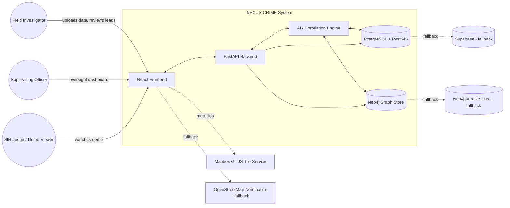
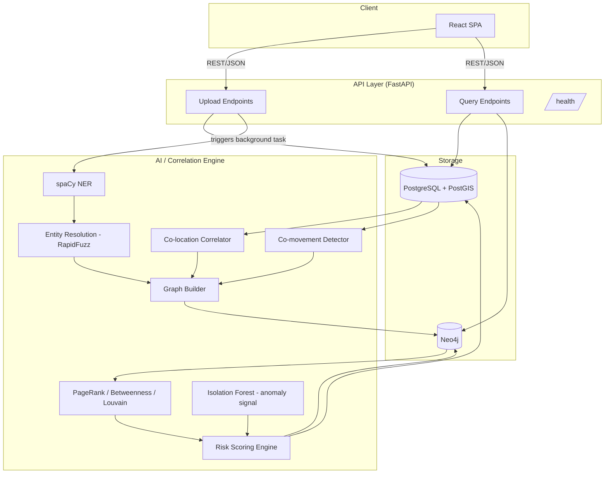
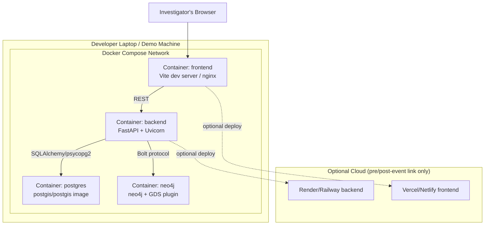
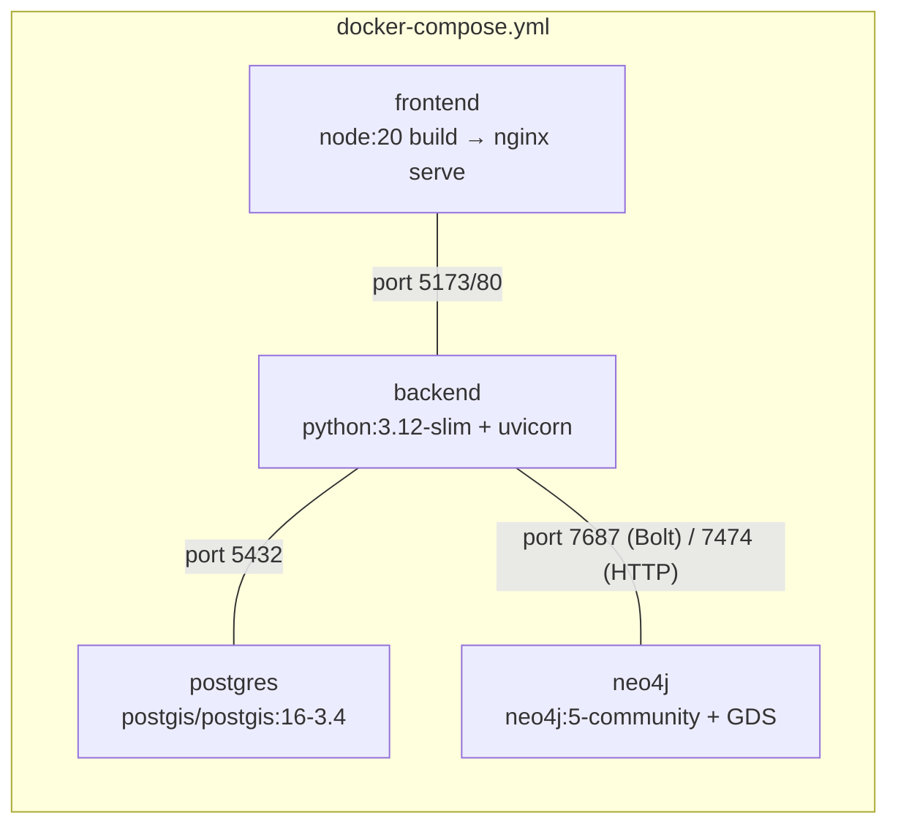
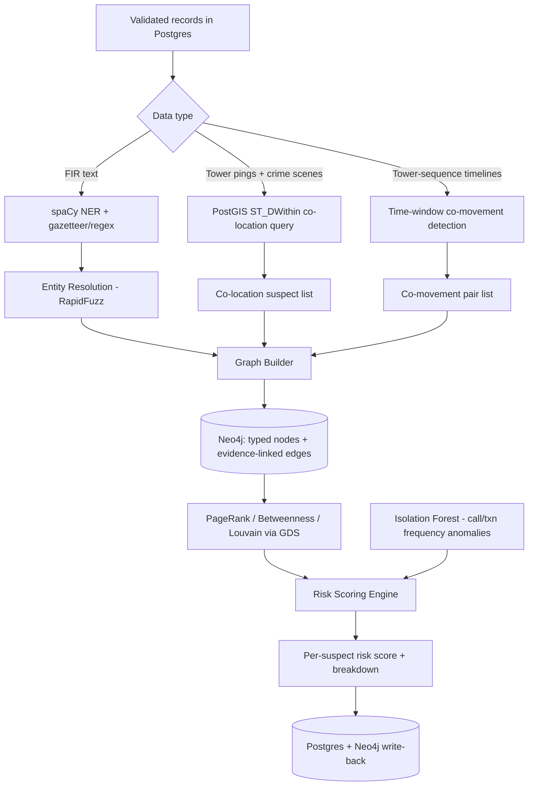
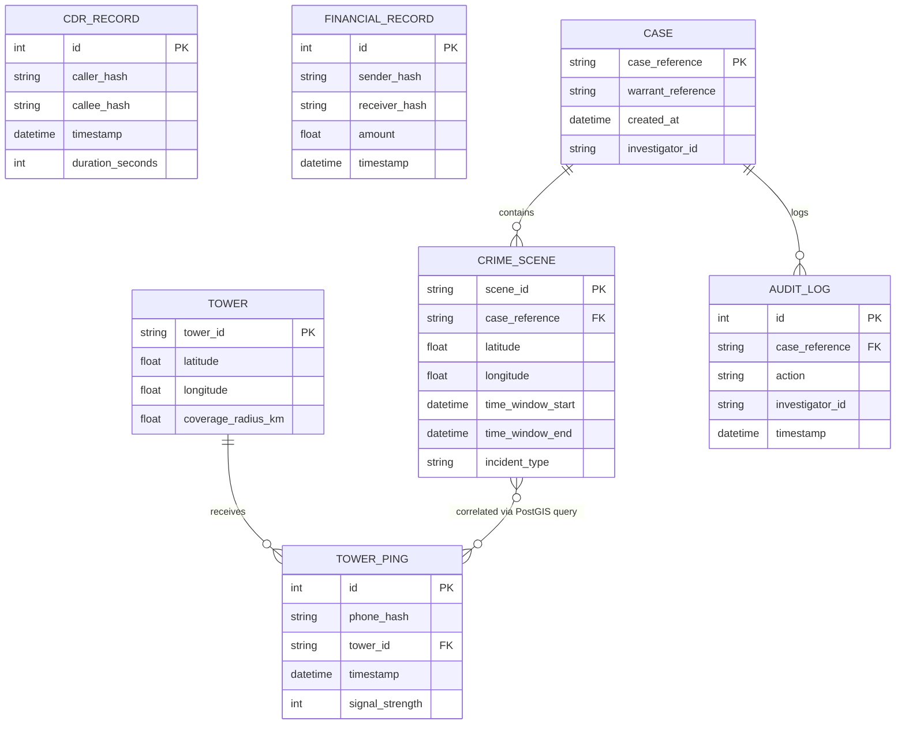
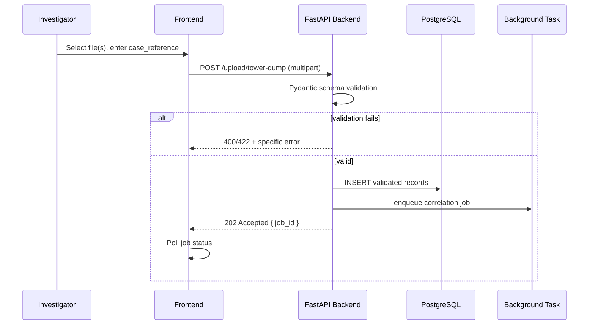
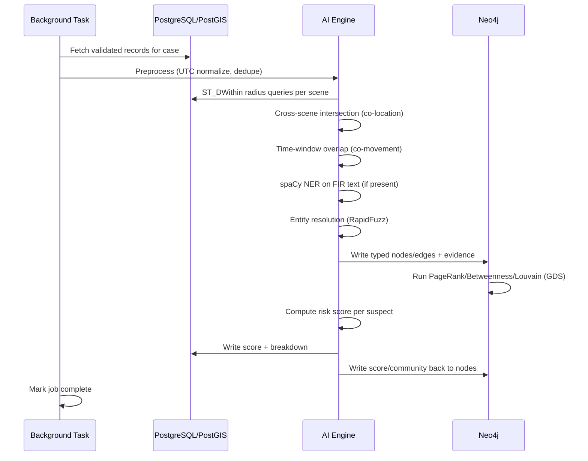
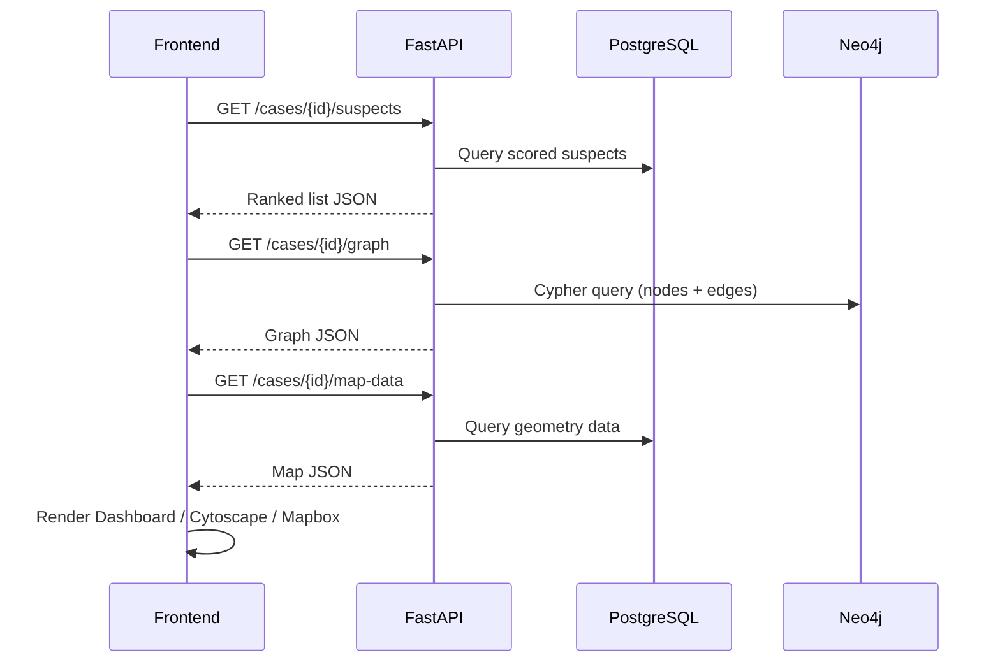

# NEXUS-CRIME — Engineering Blueprint
### The Master Implementation Guide

**Document type:** `.blueprint` (engineering blueprint, not a PRD)
**Source of truth:** `NEXUS-CRIME Product Requirements Document (PRD)`, itself derived from the `NEXUS-CRIME System Architecture & Tech Stack Report`
**Status:** Implementation-ready — an engineering team or AI coding agent should be able to start building directly from this document.

---

## 1. Project Identity

| Field | Value |
|---|---|
| **Project Name** | NEXUS-CRIME |
| **Codename** | `nexus-crime` |
| **Version** | v0.1.0 (Hackathon MVP) |
| **Mission** | Automate the mechanical cross-referencing of fragmented law-enforcement data — tower dumps, CDRs, financial records, FIR text — so investigators spend their time verifying leads, not manually building them. |
| **Vision** | Give every investigator the analytical reach of a full intelligence unit, without ever replacing human judgment or introducing opaque, unaccountable decision-making into the justice system. |
| **Core Objectives** | (1) Working end-to-end demo within a 2-day build window. (2) Architecture that survives unchanged into a real pilot. (3) Every output explainable and evidence-cited. (4) Zero mandatory external AI API dependency (offline-capable). |
| **Primary Users** | Field Investigator, Supervising Officer; System Administrator is a documented future persona only. |
| **Stakeholders** | Investigators, supervising officers, NCRB/MHA, state CID departments, SIH judges, dev team, future maintainers, civil-liberties/legal reviewers. |
| **System Overview** | A geospatial-first, graph-backed criminal network analysis platform. Multi-source data is ingested, correlated (co-location + co-movement), fused into a Neo4j relationship graph, scored by a transparent weighted formula, and presented via map, network graph, and ranked dashboard views — with every flag traceable to its source record. |

---

## 2. Engineering Principles

| Principle | How NEXUS-CRIME applies it |
|---|---|
| **Modular architecture** | Ingestion, correlation, graph, scoring, and presentation are independently deployable/testable layers (Section 5). |
| **Separation of concerns** | Frontend never touches a database directly; all writes are FastAPI-mediated and audit-logged. |
| **API-first design** | Every capability is exposed as a versionable REST endpoint (Section 11) before any UI is built against it. |
| **Offline-first / on-prem capable** | No mandatory external LLM API anywhere in the pipeline — spaCy, PostGIS, and Neo4j GDS all run locally. |
| **Explainable AI over black-box ML** | Rule-based, threshold-driven correlation and a fully decomposable linear risk score are chosen over opaque clustering, specifically because legal defensibility outranks marginal accuracy gains. |
| **Security-first** | Hashed identifiers throughout, parameterized queries only, secrets in environment variables, hard-gated legal authorization on every processing endpoint. |
| **Fault tolerance / graceful degradation** | Missing signals degrade the risk score proportionally rather than erroring; Neo4j GDS failures fall back to NetworkX. |
| **Maintainability** | Strict module boundaries (Section 5) so a contributor can modify the correlation engine without touching the graph layer or frontend. |
| **Developer experience** | Single `docker-compose up`, typed schemas end-to-end (Pydantic ↔ SQLAlchemy ↔ TypeScript types generated from OpenAPI), one command to seed synthetic data. |
| **Human-in-the-loop by design** | The system never auto-escalates or auto-concludes; every AI output is labeled an "investigative lead." |

---

## 3. High-Level System Architecture

### 3.1 System Context Diagram



### 3.2 High-Level Component Diagram



### 3.3 Deployment Diagram



### 3.4 Container Diagram



---

## 4. Complete Repository Structure

```
nexus-crime/
├── backend/
│   ├── app/
│   │   ├── main.py                  # FastAPI app factory, router registration, startup/shutdown hooks
│   │   ├── config.py                 # Pydantic Settings (env-driven config, Section 16)
│   │   ├── dependencies.py           # DI providers: db session, neo4j driver, current_investigator (stub)
│   │   ├── api/
│   │   │   ├── v1/
│   │   │   │   ├── router.py         # Aggregates all v1 routers
│   │   │   │   ├── upload.py         # /upload/* endpoints (FR-01)
│   │   │   │   ├── cases.py          # /cases/{id}/* endpoints
│   │   │   │   ├── suspects.py       # /suspects/{hash}/evidence
│   │   │   │   └── health.py         # /health
│   │   ├── schemas/                  # Pydantic request/response models (mirrors Section 18)
│   │   │   ├── tower_dump.py
│   │   │   ├── cdr.py
│   │   │   ├── financial.py
│   │   │   ├── fir.py
│   │   │   ├── suspect.py
│   │   │   └── graph.py
│   │   ├── models/                   # SQLAlchemy ORM models
│   │   │   ├── tower.py
│   │   │   ├── tower_ping.py
│   │   │   ├── crime_scene.py
│   │   │   ├── cdr_record.py
│   │   │   ├── financial_record.py
│   │   │   ├── case.py
│   │   │   └── audit_log.py
│   │   ├── services/                 # Business logic layer (called by routers, testable in isolation)
│   │   │   ├── ingestion_service.py
│   │   │   ├── correlation_service.py
│   │   │   ├── graph_service.py
│   │   │   ├── scoring_service.py
│   │   │   ├── audit_service.py
│   │   │   └── evidence_service.py
│   │   ├── ai/                       # AI/ML engine (importable independently of FastAPI)
│   │   │   ├── ner/
│   │   │   │   ├── extractor.py      # spaCy pipeline wrapper
│   │   │   │   └── gazetteer.py      # Indian-name/entity gazetteer + regex
│   │   │   ├── correlation/
│   │   │   │   ├── colocation.py     # PostGIS ST_DWithin query logic
│   │   │   │   └── comovement.py     # Time-window overlap logic
│   │   │   ├── entity_resolution/
│   │   │   │   └── resolver.py       # RapidFuzz matching + confidence banding
│   │   │   ├── graph/
│   │   │   │   ├── builder.py        # Node/edge construction, evidence attachment
│   │   │   │   └── analytics.py      # PageRank/Betweenness/Louvain (GDS) + NetworkX fallback
│   │   │   ├── scoring/
│   │   │   │   └── risk_score.py     # Section 20 formula, pure function
│   │   │   └── anomaly/
│   │   │       └── isolation_forest.py
│   │   ├── db/
│   │   │   ├── postgres.py           # Engine/session factory
│   │   │   ├── neo4j_driver.py       # Bolt driver factory
│   │   │   └── migrations/           # Alembic migration scripts
│   │   ├── core/
│   │   │   ├── logging.py            # Structured logging setup
│   │   │   ├── security.py           # SHA-256 hashing helpers, future JWT/bcrypt hooks
│   │   │   └── exceptions.py         # Custom exception classes + FastAPI exception handlers
│   │   └── background/
│   │       └── tasks.py              # Background task orchestration (post-upload pipeline trigger)
│   ├── tests/
│   │   ├── unit/                     # Section 33: correlation, scoring formula tests
│   │   ├── integration/              # Full pipeline against synthetic ground-truth dataset
│   │   └── api/                      # Postman/Thunder Client-equivalent pytest API tests
│   ├── pyproject.toml / requirements.txt
│   └── Dockerfile
│
├── frontend/
│   ├── src/
│   │   ├── main.tsx
│   │   ├── App.tsx
│   │   ├── router/                   # Route definitions (Upload, Dashboard, Map, Graph)
│   │   ├── pages/
│   │   │   ├── CaseUploadPage.tsx
│   │   │   ├── CaseDashboardPage.tsx
│   │   │   ├── MapViewPage.tsx
│   │   │   └── GraphViewPage.tsx
│   │   ├── components/
│   │   │   ├── upload/
│   │   │   ├── dashboard/            # RankedSuspectTable, RiskScoreBreakdown, CaseStatsCards
│   │   │   ├── map/                  # MapboxCanvas, LayerToggles, DeviceTimelinePanel
│   │   │   ├── graph/                # CytoscapeCanvas, NodeDetailSidebar, EdgeLegend
│   │   │   └── shared/               # ExplainabilityPanel, ErrorBanner, SkeletonLoader
│   │   ├── state/                    # Zustand stores (caseStore, uiStore)
│   │   ├── api/                      # Axios client + typed API wrappers (generated from OpenAPI)
│   │   ├── styles/                   # Tailwind config, design tokens
│   │   └── utils/
│   ├── public/
│   ├── package.json
│   ├── vite.config.ts
│   └── Dockerfile
│
├── database/
│   ├── postgres/
│   │   ├── schema.sql                # Reference DDL matching Section 17
│   │   └── seed/                     # Synthetic seed data drop-in location
│   └── neo4j/
│       └── constraints.cypher        # Uniqueness constraints, index creation Cypher
│
├── ai/
│   └── notebooks/                    # Exploratory notebooks for tuning thresholds (dev-only, not shipped)
│
├── scripts/
│   ├── generator.py                  # Synthetic data generator (tower dumps, CDRs, FIRs, financial + planted network)
│   ├── seed_db.py                    # Loads generator output into Postgres/Neo4j
│   ├── validate_recall.py            # Asserts 100% recall on planted network (Section 33)
│   └── rehearse_demo.sh              # Scripted walkthrough of the 5-minute demo script
│
├── docker/
│   ├── docker-compose.yml
│   ├── docker-compose.override.yml   # Local dev overrides (hot reload, volume mounts)
│   └── .env.example
│
├── infra/
│   ├── github-actions/
│   │   └── ci.yml                    # Stretch goal: pytest on push
│   └── render.yaml / vercel.json     # Optional cloud deploy configs
│
├── docs/
│   ├── blueprint.md                  # ← this document
│   ├── prd.md                        # Source PRD
│   ├── architecture-report.md        # Source architecture & tech-stack report
│   ├── demo-script.md
│   └── api/                          # OpenAPI export, Postman collection
│
├── tests/
│   └── e2e/                          # Full manual/scripted walkthrough checklist
│
├── configs/
│   ├── logging.yaml
│   └── risk_weights.yaml             # Externalized, tunable risk-score weights (Section 13)
│
├── .env.example
├── .gitignore
└── README.md
```

**Directory purpose summary**

| Directory | Purpose |
|---|---|
| `backend/app/api` | Thin controller layer — HTTP concerns only, delegates to `services/`. |
| `backend/app/services` | Orchestration/business logic, framework-agnostic, unit-testable. |
| `backend/app/ai` | The correlation/graph/scoring engine — importable and testable without FastAPI running. |
| `backend/app/models` vs `schemas` | Strict separation: `models` = DB shape, `schemas` = wire shape. Never conflate. |
| `database/` | Reference schema and constraints, independent of ORM migration history, for quick manual setup/audit. |
| `scripts/generator.py` | The single most important hackathon artifact — produces the planted ground-truth network used to prove correctness. |
| `configs/risk_weights.yaml` | Keeps Section 20's weights out of code, addressing Open Question in PRD Section 44. |

---

## 5. Module Blueprint

### 5.1 Frontend Module
- **Purpose:** Investigator-facing single-page application.
- **Responsibilities:** Case upload UI, ranked dashboard, map view, network graph view, explainability panel rendering.
- **Inputs:** REST/JSON responses from backend `/api/v1/*`.
- **Outputs:** Rendered UI; user interaction events (uploads, clicks, filter changes).
- **Dependencies:** React 18, Vite, Tailwind CSS, Mapbox GL JS, Cytoscape.js, Recharts, Zustand, Axios.
- **Public Interfaces:** None (leaf consumer) — communicates only via the backend REST API.
- **Internal Components:** `pages/*` (route-level), `components/{upload,dashboard,map,graph,shared}/*`.
- **Future Extensions:** Time-slider device playback (US-08 stretch), WCAG 2.1 AA audit, mobile-responsive mode.

### 5.2 Backend Module (API Layer)
- **Purpose:** Single entry point for all client interaction; enforces validation and audit logging before any data reaches storage or the AI engine.
- **Responsibilities:** Upload endpoints, query endpoints, background task orchestration, request validation, audit log writes.
- **Inputs:** HTTP requests (multipart file uploads, JSON bodies, query params).
- **Outputs:** JSON responses; enqueued background correlation jobs.
- **Dependencies:** FastAPI, Uvicorn, Pydantic, SQLAlchemy, GeoAlchemy2, psycopg2/asyncpg, neo4j-driver.
- **Public Interfaces:** REST API (Section 11).
- **Internal Components:** `api/v1/*` routers, `dependencies.py` DI graph, `core/exceptions.py` handlers.
- **Future Extensions:** Full JWT-based auth (`python-jose`, `bcrypt` already in stack, unused in MVP), RBAC middleware, rate limiting.

### 5.3 AI Engine Module
- **Purpose:** All entity extraction, correlation, graph construction, analytics, and scoring logic.
- **Responsibilities:** NER, co-location/co-movement correlation, entity resolution, graph writes, centrality/community computation, risk scoring, anomaly flagging.
- **Inputs:** Validated records from `ingestion_service`.
- **Outputs:** Structured entities, correlation result sets, graph nodes/edges, per-suspect risk scores.
- **Dependencies:** spaCy, RapidFuzz, scikit-learn, NetworkX (fallback), Neo4j GDS.
- **Public Interfaces:** Called internally by `background/tasks.py`; never exposed directly over HTTP.
- **Internal Components:** `ai/{ner,correlation,entity_resolution,graph,scoring,anomaly}/*`.
- **Future Extensions:** DBSCAN spatiotemporal clustering, temporal graph analysis, configurable per-case-type weight profiles.

### 5.4 Database Layer — Geo Engine (PostgreSQL + PostGIS)
- **Purpose:** System of record for raw ingested data and geospatial queries.
- **Responsibilities:** Store tower/tower-ping/crime-scene/CDR/financial/case/audit records; execute `ST_DWithin` radius queries.
- **Inputs:** Validated records; spatial queries from the AI engine.
- **Outputs:** Query result sets (device sets per crime scene, time-windowed pings).
- **Dependencies:** PostgreSQL 16, PostGIS 3.4.
- **Public Interfaces:** SQLAlchemy/GeoAlchemy2 ORM, direct SQL for performance-critical spatial queries.
- **Future Extensions:** Time-based partitioning of `tower_ping`, read replicas.

### 5.5 Graph Engine Module (Neo4j)
- **Purpose:** System of record for the fused relationship graph and its analytics.
- **Responsibilities:** Store typed nodes/edges with attached evidence; run PageRank, Betweenness Centrality, Louvain via GDS.
- **Inputs:** Node/edge write requests from `graph_service`.
- **Outputs:** Graph query results, centrality scores, community assignments.
- **Dependencies:** Neo4j Community Edition (or AuraDB Free), Neo4j GDS plugin, Python Bolt driver.
- **Public Interfaces:** Cypher queries via the official Neo4j Python driver.
- **Future Extensions:** Causal clustering (Enterprise Edition) for HA, temporal graph snapshots.

### 5.6 Authentication Module (Minimal for Hackathon)
- **Purpose:** Enforce legal-authorization gating; lay groundwork for future full auth.
- **Responsibilities:** Require and persist `case_reference`/warrant reference on every processing request; write `AUDIT_LOG` entries.
- **Inputs:** Case reference form field on upload.
- **Outputs:** Audit log entry (mocked `investigator_id` acceptable for hackathon).
- **Dependencies:** `python-jose`, `bcrypt` (present in stack, full flow deferred).
- **Public Interfaces:** FastAPI dependency/middleware on upload endpoints.
- **Future Extensions:** Full JWT auth, RBAC, per-agency access scoping.

### 5.7 Dashboard Module
- **Purpose:** Present the ranked, actionable suspect list — the system's primary output.
- **Responsibilities:** Render sortable/filterable suspect table, score breakdowns, case stat cards.
- **Inputs:** `GET /cases/{id}/suspects` response.
- **Outputs:** Rendered dashboard widgets (Section 32).
- **Dependencies:** React, Recharts.
- **Public Interfaces:** Consumes REST API only.

### 5.8 Analytics Module
- **Purpose:** Compute graph-theoretic importance and clustering.
- **Responsibilities:** PageRank, Betweenness Centrality, Louvain community detection.
- **Inputs:** Constructed Neo4j graph.
- **Outputs:** Per-node score/community properties written back to graph nodes.
- **Dependencies:** Neo4j GDS (primary), NetworkX (fallback, in-memory).
- **Public Interfaces:** Called by `graph_service` post graph-construction.

### 5.9 Monitoring Module (Minimal for Hackathon)
- **Purpose:** Cross-cutting observability.
- **Responsibilities:** Structured logging on ingestion, extraction, correlation, graph-write, and scoring stages.
- **Inputs:** Stage execution events (start, success, failure, duration).
- **Outputs:** Console/file log lines (JSON-formatted where time permits).
- **Dependencies:** Python `logging` module.
- **Public Interfaces:** `core/logging.py` logger instance imported cross-module.
- **Future Extensions:** Log aggregator (e.g., ELK/Grafana Loki), metrics dashboard, distributed tracing.

### 5.10 Deployment Module
- **Purpose:** Containerize and orchestrate all services for reproducible local/demo runs.
- **Responsibilities:** Bring up Postgres+PostGIS, Neo4j+GDS, backend, frontend with one command.
- **Inputs:** `docker-compose.yml`, `.env`.
- **Outputs:** Running service network.
- **Dependencies:** Docker, Docker Compose.
- **Public Interfaces:** N/A — infrastructure layer.

### 5.11 Testing Module
- **Purpose:** Prove correctness against known ground truth.
- **Responsibilities:** Unit tests on correlation/scoring functions; integration test asserting 100% recall on the planted synthetic network.
- **Inputs:** Synthetic dataset from `scripts/generator.py`.
- **Outputs:** Pass/fail test reports.
- **Dependencies:** pytest.
- **Public Interfaces:** Runs directly against backend service functions (no HTTP round-trip required for unit tests).

---

## 6. Service Architecture

| Service | Purpose | Communication | Dependencies | Lifecycle | Scaling Strategy | Failure Recovery |
|---|---|---|---|---|---|---|
| **frontend** | Serve SPA, render views | HTTP/REST to backend | backend | Started by Compose; stateless | Horizontal (multiple replicas behind a static host/CDN in production) | Retry-once on API timeout, then error state with cached last-known-good data |
| **backend (API)** | Validate, orchestrate, expose REST | REST/JSON in; SQL + Bolt out | postgres, neo4j | Started by Compose; stateless (session state lives in DB) | Horizontal (stateless FastAPI workers behind a load balancer, production) | FastAPI exception handlers return structured errors; background task failures logged, not silent |
| **correlation background task** | Run the AI pipeline post-upload | Invoked in-process by backend (async task / job queue in production) | postgres, neo4j, spaCy models | Triggered per upload; decoupled from request/response cycle | Production: move to a real task queue (Celery/RQ + Redis) for horizontal worker scaling | Basic retry-on-transient-failure pattern (documented, not required for hackathon) |
| **postgres** | Relational + geospatial store | PostgreSQL wire protocol | PostGIS extension | Started by Compose; stateful (volume-backed) | Vertical (hackathon); read replicas + partitioning (production) | Manual `docker-compose up` restart (hackathon); managed backups (production) |
| **neo4j** | Graph store + analytics | Bolt protocol | GDS plugin | Started by Compose; stateful (volume-backed) | Vertical (hackathon); causal clustering (Enterprise, production) | Manual restart (hackathon); AuraDB fallback documented |

---

## 7. Backend Blueprint

**API architecture:** Versioned REST (`/api/v1/...`), resource-oriented, FastAPI's native OpenAPI schema serves as the API contract and the source for generated frontend TypeScript types.

**Controllers (`api/v1/*.py`):** Thin — parse request, call one service method, map result/exception to response. No business logic in controllers.

**Services (`services/*.py`):** All business logic lives here, framework-agnostic, directly unit-testable without spinning up FastAPI.

**Business logic:** Implemented as pure functions where possible (especially `ai/scoring/risk_score.py`, Section 13) so they can be tested with hand-computed expected outputs.

**Validation:** Pydantic schemas on every request body; PostGIS geometry validation on coordinate inputs; explicit schema-per-data-type column checks before any DB write (FR-01).

**Authentication:** Case/warrant reference required in form field for MVP (Section 5.6); JWT scaffolding present but inactive.

**Authorization:** Not implemented as RBAC in MVP; documented as P0 for production (Section 26).

**Error handling:** Central `core/exceptions.py` maps domain exceptions (`SchemaValidationError`, `MissingCaseReferenceError`, `UnknownTowerIdError`, etc.) to the correct HTTP status + structured error body (Section 13.2 error table).

**Middleware:** Case-reference-presence check on upload routes; structured request-logging middleware (request ID injection).

**Background jobs:** `background/tasks.py` — triggered via FastAPI `BackgroundTasks` for hackathon scope; documented upgrade path to Celery/RQ for production.

**Caching:** None required at hackathon scale; Redis documented as optional for repeated map/graph queries.

**Logging:** `core/logging.py` — structured logger, one line per pipeline stage transition, includes request ID, timestamp, stage, outcome.

**Configuration:** `config.py` — Pydantic `BaseSettings` reading from `.env` (Section 16).

**Dependency Injection:** FastAPI's native `Depends()` system — `get_db_session()`, `get_neo4j_driver()`, `get_current_investigator()` (stub) all defined in `dependencies.py`.

---

## 8. Frontend Blueprint

**Application architecture:** Single-page app, route-per-view, global state via Zustand (`caseStore` holds active case ID + cached query results; `uiStore` holds layer toggles/filter state).

**Routing:** `/upload`, `/cases/:caseId` (redirects to dashboard tab), `/cases/:caseId/dashboard`, `/cases/:caseId/map`, `/cases/:caseId/graph` — implemented as tabs within one persistent shell per Section 30 (UX Principles: single-page dashboard, tabbed views).

**Pages:** `CaseUploadPage`, `CaseDashboardPage`, `MapViewPage`, `GraphViewPage`.

**Layouts:** Persistent sidebar (case metadata) + full-width/full-height content area for map/graph views.

**Components:** Broken down per Section 31 UI Specifications — see repository structure Section 4 for the full component tree.

**Reusable UI:** `ExplainabilityPanel` (modal/sidebar, shared across dashboard/map/graph), `ErrorBanner` (non-blocking), `SkeletonLoader`.

**State management:** Zustand stores; server data fetched via React Query-style hooks wrapping Axios (or plain Axios + Zustand cache, given hackathon time constraints).

**API layer:** `src/api/*.ts` — one typed wrapper module per backend resource, generated/kept in sync with the OpenAPI schema.

**Loading strategy:** Skeleton loaders on dashboard widgets while the background correlation task runs; explicit job-status polling tied to `job_id` returned from upload.

**Error boundaries:** Route-level React error boundaries; API-layer retry-once-then-error-state pattern (Section 6).

**Responsiveness:** Desktop-first, explicitly scoped as an investigator-workstation tool, not mobile-first (Section 30).

**Accessibility:** Basic WCAG contrast/labeling practices within hackathon timeline; full WCAG 2.1 AA audit is future roadmap (Section 25).

---

## 9. AI Blueprint

### 9.1 Pipeline Overview



### 9.2 Inference Flow (per upload)
1. Backend receives file → validates schema → writes raw records to Postgres → returns `202 Accepted` with `job_id` immediately.
2. Background task begins: preprocessing (UTC normalization, ping deduplication into presence intervals).
3. Correlation: PostGIS radius query per crime scene → cross-scene device-set intersection (co-location) → time-window overlap check (co-movement).
4. If FIR text present: spaCy NER → confidence-threshold filter → entity resolution.
5. Graph Builder writes all relationship types as typed Neo4j edges, each carrying its source evidence array.
6. GDS runs PageRank, Betweenness, Louvain over the case subgraph (fallback: NetworkX in-memory if GDS unavailable).
7. Risk Scoring Engine combines centrality + co-location count + co-movement count + call/transaction frequency into a 0–1 score (Section 13).
8. Results persisted to both stores; job marked complete; frontend polling picks up completion.

### 9.3 Preprocessing
- Timestamp normalization to UTC.
- Deduplication of repeated pings within short intervals into presence intervals.
- Tower ID → lat/long join via PostGIS.

### 9.4 NER
- spaCy `en_core_web_sm` (speed) or `en_core_web_trf` (accuracy) — selectable via config; augmented with regex for phone numbers/vehicle plates and an Indian-name gazetteer for local naming-convention recall.
- Confidence threshold filtering before any entity participates in graph construction; sub-threshold entities are held in a human-review state, never silently dropped or silently accepted.

### 9.5 Graph Generation
- Entity resolution (RapidFuzz fuzzy matching) merges variant references before node creation.
- Matches in the 70–90% confidence band are routed to a human-review queue; MVP creates them provisionally pending review (see Open Question, Section 26 of this blueprint / Section 44 of PRD).

### 9.6 Correlation Engine
- **Co-location:** `ST_DWithin` radius query per crime scene → device flagged if present in ≥2 distinct scenes.
- **Co-movement:** Same tower within a ±15-minute window on ≥2 distinct calendar days.

### 9.7 Confidence Scoring
- NER and entity-resolution outputs both carry confidence scores; thresholds gate graph participation, with an explicit human-review state as the third option (never a binary accept/reject).

### 9.8 Explainability
- Not reconstructed after the fact — every scored node/edge stores its source evidence (tower ID, timestamp, transaction ID, scene ID) at write time, enforced by the data model itself (Section 10).

### 9.9 Future ML Improvements
- DBSCAN-based fuzzy spatiotemporal clustering as a v2 complement to rule-based correlation (preserves current explainability as a floor, not a ceiling).
- Temporal graph analysis (network evolution, not a static snapshot).
- Configurable, case-type-specific risk weight profiles.

---

## 10. Database Blueprint

### 10.1 Relational Schema (PostgreSQL + PostGIS)



### 10.2 Graph Schema (Neo4j)
- **Node labels:** `Device`, `Person` (optional, post-resolution), `Location`.
- **Relationship types:**
  - `CO_LOCATED_AT` — properties: `weight`, `scene_ids`
  - `CO_MOVED_WITH` — properties: `weight`, `event_timestamps`
  - `CALLED` — properties: `count`, `total_duration`
  - `TRANSACTED_WITH` — properties: `count`, `total_amount`

### 10.3 Indexes
| Table/Column | Index type | Reason |
|---|---|---|
| `tower_ping(phone_hash)` | B-tree | Fast per-device lookup |
| `tower_ping(timestamp)` | B-tree | Fast time-window filtering |
| `crime_scene(geometry)` | GiST (PostGIS default) | `ST_DWithin` performance — non-negotiable |
| `cdr_record(caller_hash, callee_hash)` | Composite B-tree | Fast pair lookups |
| Neo4j: `Device.phone_hash` | Uniqueness constraint | Prevent duplicate device nodes |

### 10.4 Constraints
- `crime_scene.case_reference` → `case.case_reference` (FK)
- `tower_ping.tower_id` → `tower.tower_id` (FK)
- `audit_log.case_reference` → `case.case_reference` (FK)
- Uniqueness: `tower_ping(phone_hash, tower_id, timestamp)` composite — rejects exact duplicate ingestion (Edge Case, Section 13.5).

### 10.5 Normalization
Third normal form across all relational tables; raw geometry kept in PostGIS-native geometry columns rather than duplicated lat/long floats where spatial queries are performed (both are documented in this schema for developer clarity — production should collapse to a single `geography` column).

### 10.6 Partitioning
Time-based partitioning of `tower_ping` recommended once record counts move into the millions — documented, not implemented, for hackathon scope.

### 10.7 Optimization
GiST spatial index is mandatory. Batched Neo4j writes (not per-edge) recommended once graph size grows past demo scale.

### 10.8 Backup Strategy
Hackathon: none (ephemeral demo data). Production: scheduled `pg_dump` + Neo4j backup utility, retention aligned with DPDP Act 2023 and DoT tower-dump retention rules (documented compliance requirement, not implemented).

### 10.9 Migration Strategy
Alembic for PostgreSQL schema migrations (`backend/app/db/migrations/`); Neo4j schema changes tracked as versioned Cypher scripts in `database/neo4j/` and applied idempotently (`CREATE CONSTRAINT IF NOT EXISTS`).

---

## 11. API Blueprint

Base path: `/api/v1`. All endpoints return JSON. Versioning strategy: URI-versioned (`/v1`, `/v2`...); breaking changes require a new version prefix, not in-place field removal.

### `POST /upload/tower-dump`
- **Purpose:** Ingest a tower dump CSV for a case.
- **Auth:** `case_reference` required form field (full auth deferred).
- **Inputs:** `multipart/form-data` — `case_reference: string`, `file: CSV (phone_hash, tower_id, timestamp, signal_strength)`.
- **Outputs:** `{ status, records_ingested, records_rejected, job_id }`.
- **Validation:** All 4 columns required; `timestamp` ISO 8601; `tower_id` must exist in tower metadata.
- **Errors:** `MISSING_CASE_REFERENCE` (422), `INVALID_SCHEMA` (400), `UNKNOWN_TOWER_ID` (400).
- **Status codes:** `202 Accepted`, `400`, `422`.
- **Example:** `curl -F "case_reference=CASE-2026-114" -F "file=@tower_dump.csv" http://localhost:8000/api/v1/upload/tower-dump`
- **Rate limits:** None at hackathon scale; documented production requirement.

### `POST /upload/cdr`
- Same contract shape; schema `caller_hash, callee_hash, timestamp, duration`.

### `POST /upload/financial`
- Same contract shape; schema `sender_hash, receiver_hash, amount, timestamp`.

### `POST /upload/fir-text`
- **Inputs:** `{ case_reference: string, text: string }`.
- **Outputs:** `{ entities_extracted: [...], job_id: uuid }`.

### `GET /cases/{case_id}/suspects`
- **Purpose:** Ranked suspect list with risk scores.
- **Outputs:**
```json
{
  "suspects": [
    {
      "device_hash": "string",
      "risk_score": 0.87,
      "score_breakdown": {
        "centrality": 0.3,
        "colocation_count": 3,
        "comovement_count": 5,
        "call_frequency": 12
      },
      "flagged_scenes": ["scene_1", "scene_3"]
    }
  ]
}
```
- **Status codes:** `200 OK`, `404 Not Found`.

### `GET /cases/{case_id}/graph`
- **Purpose:** Graph structure for network visualization.
- **Outputs:** `{ nodes: [{id, risk_score, community}], edges: [{source, target, type, weight, evidence}] }`.

### `GET /cases/{case_id}/map-data`
- **Purpose:** Tower, crime-scene, and suspect coordinates for map rendering.
- **Outputs:** `{ towers: [...], crime_scenes: [...], flagged_devices: [...] }`.

### `GET /suspects/{device_hash}/evidence`
- **Purpose:** Explainability panel data.
- **Outputs:** `{ device_hash, evidence: [{type, tower_id, timestamp, scene_id}] }`.

### `GET /health`
- **Purpose:** Confirm DB connectivity before demo starts (Section 21).
- **Outputs:** `{ status: "ok", postgres: "ok", neo4j: "ok" }`.

---

## 12. Data Flow Blueprint

### 12.1 Upload Flow



### 12.2 Processing Flow



### 12.3 Storage Flow
Raw/geo data → PostgreSQL+PostGIS (system of record for source records). Relationship/graph data → Neo4j (system of record for connections and analytics). Both are written within the same backend request/task lifecycle with a rollback-on-failure convention (full two-phase commit explicitly out of scope for hackathon).

### 12.4 Visualization Flow



### 12.5 Graph Pipeline
Correlation outputs (co-location, co-movement) + CDR + financial records → entity-resolved → Neo4j nodes/edges with evidence arrays → GDS analytics → scores written back.

### 12.6 AI Pipeline
See Section 9.1 diagram.

---

## 13. Business Logic Blueprint

### 13.1 Risk Scoring Formula
**Inputs:** `centrality_normalized` (0–1, PageRank/Betweenness), `colocation_count` (int), `comovement_count` (int), `call_frequency_with_flagged` (int, min-max normalized within case dataset).

**Decision rule:**
```
risk_score = (0.30 × centrality_normalized)
           + (0.25 × min(colocation_count / 5, 1.0))
           + (0.25 × min(comovement_count / 5, 1.0))
           + (0.20 × call_frequency_with_flagged_normalized)
```
Normalization caps at 5 occurrences (tunable constant, externalized to `configs/risk_weights.yaml` — not hardcoded).

**Fallback logic:** If a signal is entirely unavailable (e.g., no CDR data uploaded), its term is excluded and remaining weights are proportionally re-normalized so the score stays on a comparable 0–1 scale.

**Edge cases:** All-signals-missing case → score undefined, suspect excluded from ranked list with a logged warning (not silently scored 0).

### 13.2 Co-location Flagging Rule
**Inputs:** Set of `(device, scene)` pairs per crime-scene query.
**Decision rule:** Flag if device appears in ≥2 distinct crime scenes for the same case.
**Fallback:** Single-scene presence retained in the data model, visible on request, but not surfaced as a default flag (avoids bystander noise).
**Edge case:** Boundary-timestamp pings resolved via inclusive boundary handling.

### 13.3 Co-movement Flagging Rule
**Inputs:** Tower-sequence timelines for a device pair.
**Decision rule:** Flag if devices share a tower within ±15 minutes on ≥2 distinct calendar days.
**Fallback:** Single same-day occurrence logged as weak evidence only.
**Edge case:** Sparse-ping devices produce false negatives — documented limitation, not hidden.

### 13.4 Entity Resolution
**Decision rule:** RapidFuzz similarity ≥90% → auto-merge; 70–90% → human-review queue; <70% → treated as distinct entities.
**Failure case:** Ambiguous merges of genuinely different people with similar (e.g., common Indian) names — mitigated, not eliminated, by the review queue.

### 13.5 Duplicate Ingestion Handling
**Decision rule:** Reject exact duplicate `(phone_hash, tower_id, timestamp)` composite on re-upload to prevent double-counting.

---

## 14. Security Blueprint

| Area | MVP Implementation | Production Requirement |
|---|---|---|
| **Authentication** | Case/warrant reference required per upload, logged to `AUDIT_LOG` | Full JWT auth (`python-jose`), bcrypt password hashing |
| **Authorization** | None (RBAC not implemented) | Role-based access control, per-agency scoping (Persona 3, Section 7) |
| **Encryption** | Phone/IMSI hashed (SHA-256) before entering pipeline; raw identifiers never stored | TLS everywhere in transit; encryption at rest for production DBs |
| **Secrets** | `.env`, excluded via `.gitignore`, never hardcoded | Secrets manager (Vault/cloud KMS) |
| **Input validation** | Pydantic schema validation on all uploads; PostGIS geometry validation | Same, plus stricter file-size/type limits |
| **Injection protection** | SQLAlchemy parameterized queries; Neo4j driver parameterized Cypher — never string-concatenated | Same, enforced via lint rule / code review checklist |
| **API protection** | No rate limiting (single-user demo context) | Rate limiting, request throttling per investigator/agency |
| **Audit logging** | `AUDIT_LOG` records every query and merge decision with investigator ID + timestamp | Immutable/append-only audit store, tamper-evidence |
| **Role-based permissions** | Not implemented | Investigator (case-scoped) vs. Supervisor (jurisdiction-scoped) vs. Admin (no case-data access) |
| **Secure storage** | Local Docker volumes | Encrypted managed storage, backup retention per DPDP Act 2023 |

---

## 15. Infrastructure Blueprint

**Docker:** `docker-compose.yml` brings up `postgres` (postgis/postgis image, no manual extension setup needed), `neo4j` (with GDS plugin enabled at container start), `backend`, `frontend` — one command (`docker-compose up`).

**Networking:** All services on one Compose bridge network; only `frontend` (and optionally `backend`, for API testing) ports exposed to host.

**Environment variables:** `.env` — `DATABASE_URL`, `NEO4J_URI`, `NEO4J_USER`, `NEO4J_PASSWORD`, `MAPBOX_API_KEY`, `LOG_LEVEL`, `RISK_WEIGHTS_PATH`.

**Cloud deployment:** Optional — Render/Railway for backend, Vercel/Netlify for frontend, purely as a pre/post-event shareable link. Judged demo runs local-first to eliminate network-dependency risk.

**Local deployment:** Primary path. `docker-compose up` → `scripts/seed_db.py` → open frontend.

**CI/CD:** Stretch goal — GitHub Actions workflow running `pytest` on push (`infra/github-actions/ci.yml`).

**Secrets management:** `.env` + `.gitignore` discipline from Day 1.

**Monitoring:** Console/file structured logs (hackathon); log aggregator (production, Section 19).

**Backups:** Not implemented (hackathon, ephemeral data); scheduled backups (production, Section 10.8).

---

## 16. Configuration Blueprint

| File | Location | Purpose | Key Variables | Environment Differences |
|---|---|---|---|---|
| `.env` | repo root / `docker/` | Runtime secrets & connection strings | `DATABASE_URL`, `NEO4J_URI`, `NEO4J_USER`, `NEO4J_PASSWORD`, `MAPBOX_API_KEY` | Dev uses local Docker hostnames (`postgres`, `neo4j`); prod points to managed instances |
| `backend/app/config.py` | backend | Typed settings loader (Pydantic `BaseSettings`) | Mirrors `.env` keys with defaults for local dev | `DEBUG=true` in dev, `false` in prod |
| `configs/risk_weights.yaml` | `configs/` | Externalized, tunable Section 13 weights | `centrality: 0.30`, `colocation: 0.25`, `comovement: 0.25`, `call_frequency: 0.20`, `cap: 5` | Same defaults across environments; per-case-type overrides are future scope |
| `configs/logging.yaml` | `configs/` | Log format/level configuration | `level`, `format`, `handlers` | Verbose in dev, structured-JSON-only in prod |
| `docker/docker-compose.yml` | `docker/` | Service topology | Image versions, volume mounts, port mappings | `docker-compose.override.yml` adds hot-reload volumes in dev only |
| `frontend/.env` | `frontend/` | Frontend-visible config (build-time) | `VITE_API_BASE_URL`, `VITE_MAPBOX_TOKEN` | Points to `localhost:8000` in dev, deployed backend URL in prod |

---

## 17. Development Workflow

- **Git strategy:** Trunk-based for the hackathon window (`main` + short-lived feature branches); GitFlow-style `develop`/`release` branches recommended if the project moves to a longer-lived pilot.
- **Branching:** `feature/<short-description>`, `fix/<short-description>`.
- **Pull Requests:** Required even under time pressure for anything touching `ai/scoring` or `ai/correlation` (the parts that must remain provably correct); solo-author self-merge acceptable elsewhere for hackathon speed.
- **Code reviews:** Lightweight — focus review time on the correlation/scoring logic and the explainability data-model enforcement (Section 10, FR-10), since these are the system's credibility anchors.
- **Coding standards:** See Section 24.
- **Commit conventions:** Conventional Commits (`feat:`, `fix:`, `docs:`, `test:`, `chore:`) for a clean, presentable history for judges.
- **Release process:** Tag `v0.1.0` at the point the demo script is fully rehearsed and passing.
- **Versioning:** SemVer; API versioning is independent (`/v1`) from repo release tags.

---

## 18. Testing Blueprint

| Level | Scope | Tooling | Pass Criterion |
|---|---|---|---|
| **Unit** | `ai/correlation/*`, `ai/scoring/risk_score.py` against small hand-computed inputs | pytest | Exact match on hand-computed expected outputs |
| **Integration** | Full ingestion → correlation → graph-write pipeline against synthetic ground-truth dataset | pytest + `scripts/validate_recall.py` | 100% recall on planted suspects |
| **API** | Every endpoint in Section 11, including malformed-input error cases | pytest + httpx test client (Postman/Thunder Client for manual pass) | Correct status codes and error codes per endpoint |
| **Load** | Ingestion endpoint at higher record volumes | Locust (future scope) | Not a hackathon priority |
| **Performance** | End-to-end timing against demo dataset | Manual timing / `time` in `rehearse_demo.sh` | < 30s for ~5,000 tower ping records (KPI, Section 5 of PRD) |
| **Security** | Manual review — no raw phone numbers in responses/logs; parameterization confirmed | Manual code review checklist | No PII leakage; no string-concatenated queries anywhere |
| **End-to-End** | Full manual walkthrough of demo script (upload → correlation → map/graph → explainability) | Manual, ≥2 rehearsals before judging | Demo script completes without error |
| **User Acceptance** | Fresh (uninvolved) team member interprets dashboard/graph without extra explanation | Manual | UX is legible to a first-time viewer, proxy for investigator first impression |

---

## 19. Observability Blueprint

- **Logging:** Structured (JSON where time permits) log line at every pipeline stage transition — ingestion, entity extraction, correlation, graph write, scoring — each with request ID, timestamp, stage, outcome.
- **Metrics:** Correlation job duration, ingestion success/failure counts, API response times — logged but not yet dashboarded at hackathon scope.
- **Tracing:** Full distributed tracing not implemented; a request ID propagated through every stage's log lines serves as a lightweight substitute.
- **Alerts:** Not implemented; documented production requirement (e.g., alert on ingestion failure-rate spike).
- **Dashboards:** The product dashboard (Section 32 of PRD) is investigator-facing, not operator-facing; an operator monitoring dashboard is future roadmap.
- **Health checks:** `GET /health` confirms Postgres + Neo4j connectivity — run before every demo/judging session.

---

## 20. Scalability Blueprint

| Layer | Hackathon Scale | Production Scaling Path |
|---|---|---|
| **Backend** | Single Uvicorn worker | Horizontal — multiple stateless FastAPI workers behind a load balancer |
| **Correlation background task** | In-process `BackgroundTasks` | Migrate to Celery/RQ + Redis for horizontal worker scaling and retry semantics |
| **PostgreSQL** | Single instance | Read replicas; time-based partitioning of `tower_ping` once record counts move into the millions |
| **Neo4j** | Community Edition, single instance | Causal clustering (Enterprise Edition) or AuraDB paid tier |
| **Caching** | None | Redis for repeated map/graph query caching |
| **Async processing** | Background task per upload | Queue-based worker pool for concurrent multi-case processing |
| **Microservice migration path** | Monolithic backend | Split `ai/` engine into an independently scalable service behind an internal API if correlation load grows disproportionately to request load |

---

## 21. Reliability Blueprint

- **Retries:** Background correlation task should implement basic retry-on-transient-failure (e.g., dropped DB connection) — documented good practice, not required for hackathon stability.
- **Timeouts:** DB and Bolt driver connection timeouts configured with sane defaults (5–10s) to avoid indefinite hangs on a dead container.
- **Circuit breakers:** Not implemented at hackathon scale; documented production requirement if external services (Mapbox, cloud DB fallbacks) are added.
- **Recovery:** Manual `docker-compose down && docker-compose up` is the accepted recovery mechanism for the demo environment.
- **Failover:** Neo4j AuraDB Free and Supabase documented as manual-switchover fallbacks if local Docker services fail (Section 22 of PRD, Third Party Services).
- **Graceful degradation:** Missing signal → risk score term excluded and reweighted (Section 13.1); GDS unavailable → NetworkX fallback (Section 5.8); missing tower metadata → skip that tower's pings, log warning, return partial results.
- **Backup strategies:** Not implemented (hackathon, ephemeral data); production requirement documented (Section 10.8).

---

## 22. Performance Blueprint

- **Latency goals:** End-to-end pipeline < 30s for ~5,000 tower ping records + ~500 CDR records. API p95 < 500ms for dashboard/graph/map query endpoints (excluding the async correlation job itself).
- **Database optimization:** GiST spatial index on `crime_scene` geometry is mandatory; composite index on `cdr_record(caller_hash, callee_hash)`.
- **Frontend optimization:** Skeleton loaders instead of blocking spinners; layer toggles on the map to avoid rendering all data types by default; pagination/filtering by minimum risk score when node count exceeds a rendering threshold on the network graph.
- **Backend optimization:** FastAPI async request handling allows concurrent map/graph/dashboard queries without blocking; correlation runs as a background task so the upload response is immediate.
- **AI optimization:** Batched Neo4j writes instead of per-edge writes (production); precomputed centrality caching for large graphs (production).
- **Network optimization:** REST/JSON payloads kept minimal (evidence arrays paginated if they grow large); Mapbox tile caching handled by the Mapbox client SDK itself.

---

## 23. Developer Handbook

**Clone & setup:**
```bash
git clone <repo-url> nexus-crime && cd nexus-crime
cp .env.example .env   # fill in MAPBOX_API_KEY, DB credentials
```

**Run locally (Docker, recommended):**
```bash
docker-compose -f docker/docker-compose.yml up --build
python scripts/generator.py        # produce synthetic dataset + planted network
python scripts/seed_db.py          # load it into Postgres/Neo4j
```
Frontend: `http://localhost:5173` (dev) or `http://localhost:80` (built). Backend: `http://localhost:8000/docs` (FastAPI auto-generated Swagger UI).

**Run locally (without Docker):**
```bash
# Backend
cd backend && python -m venv .venv && source .venv/bin/activate
pip install -r requirements.txt
uvicorn app.main:app --reload

# Frontend
cd frontend && npm install && npm run dev
```

**Build:** `docker-compose build` (containers) or `npm run build` (frontend static assets).

**Test:**
```bash
cd backend && pytest tests/unit tests/integration tests/api
python scripts/validate_recall.py   # asserts 100% recall on planted network
```

**Deploy:** Local-first for judging (`docker-compose up`). Optional cloud link: `infra/render.yaml` (backend), `infra/vercel.json` (frontend).

**Debug:** `GET /health` first; `docker-compose logs backend`/`neo4j`/`postgres`; Neo4j Browser at `http://localhost:7474` for direct Cypher inspection; pgAdmin/DBeaver for direct SQL inspection.

**Add a feature:**
1. Define/extend the Pydantic schema (`backend/app/schemas/`).
2. Add the service method (`backend/app/services/`).
3. Add the thin controller route (`backend/app/api/v1/`).
4. Write the unit test first if it touches correlation/scoring logic.
5. Add the frontend API wrapper (`frontend/src/api/`) and consuming component.

**Add a database model:** Add SQLAlchemy model → Alembic migration (`alembic revision --autogenerate`) → update `database/postgres/schema.sql` reference DDL to stay in sync.

**Extend the AI pipeline:** New correlation signal → add to `ai/correlation/` → wire into `graph_service` → add its weight to `configs/risk_weights.yaml` (never hardcode a new weight in `risk_score.py`) → add unit test with hand-computed expected output.

---

## 24. Coding Standards

- **Naming conventions:** `snake_case` for Python, `camelCase` for TypeScript/React, `PascalCase` for React components and Python classes. Database columns: `snake_case`. API JSON fields: `snake_case` (matches Python/Pydantic directly, avoids a translation layer).
- **Folder organization:** Mirrors Section 4 exactly — no ad hoc top-level folders without updating this blueprint.
- **Documentation standards:** Every service function has a docstring stating purpose, inputs, outputs, and failure cases (mirrors the FR-xx format in Section 11 of the source PRD).
- **Commenting rules:** Comment *why*, not *what*, especially around threshold constants (e.g., "±15 min window chosen per Section 13.3 — do not change without updating `configs/risk_weights.yaml` and the corresponding unit test").
- **Error handling conventions:** Never swallow exceptions silently; every caught exception is either re-raised as a domain exception or logged with full context before returning a graceful fallback (Section 21).
- **Logging conventions:** One structured log line per pipeline-stage transition, minimum fields: `request_id`, `timestamp`, `stage`, `outcome`.
- **Architecture conventions:** Controllers stay thin; business logic stays in `services/`; AI logic stays in `ai/` and must remain importable/testable without a running FastAPI app or live database connection (use dependency injection / test fixtures).

---

## 25. Future Expansion Blueprint

- **Future modules:** Full RBAC/multi-user auth module; real CCTNS/ICJS schema adapter module; streaming ingestion module (replacing batch CSV upload); operator-facing monitoring dashboard module.
- **Plugin architecture:** Correlation signals designed as independently pluggable functions feeding a common `evidence` + `weight` contract into the Graph Builder — a new signal type (e.g., social-media co-mention) can be added without modifying existing correlators, only registering a new one and a new weight entry.
- **Extension points:** `configs/risk_weights.yaml` (scoring), `ai/correlation/` (new signal types), `ai/graph/analytics.py` (new GDS algorithms), `database/neo4j/constraints.cypher` (new node/edge types).
- **Migration strategy:** Lift-and-shift to Neo4j AuraDB (paid tier) and managed PostgreSQL (Supabase paid tier or cloud-provider managed Postgres) requires only a connection-string change — no architectural changes, since the local Docker setup already mirrors the same interfaces.
- **Cloud-native evolution:** Split `ai/` engine into an independently deployable service (Section 20) once correlation load justifies it; move background tasks to Celery/RQ + Redis.
- **AI upgrades:** DBSCAN spatiotemporal clustering, temporal graph analysis, per-case-type configurable weight profiles, expanded anomaly detection beyond Isolation Forest.
- **Enterprise features:** Multi-agency RBAC, cross-jurisdiction case linking, formal WCAG 2.1 AA compliance, production-grade monitoring/alerting stack, disaster recovery plan.

---

## 26. Engineering Risks

| Category | Risk | Mitigation |
|---|---|---|
| Technical | Neo4j GDS plugin fails to install/configure under time pressure | NetworkX fallback for centrality/community detection (Section 5.8, FR-06) |
| Technical | PostGIS extension misconfigured in local Postgres | Use `postgis/postgis` Docker image directly (pre-installed extension), avoid manual `CREATE EXTENSION` steps under time pressure |
| Operational | Running out of build time before all MVP items complete | Strict adherence to MVP scope; deprioritize stretch items (US-08 time slider) first |
| Product | Judges perceive the system as a surveillance tool despite mitigations | Lead the demo with the ethics/legal-authorization framing; foreground the "investigative lead," never "conclusion," language throughout the UI |
| Security | Demo accidentally exposes a hardcoded API key/credential | `.env` + `.gitignore` discipline enforced from Day 1, not retrofitted |
| Hackathon | Live demo fails due to a dependency (Mapbox quota, network issue) | Rehearse fully offline-capable fallback: local Docker services + cached tiles if possible, or a pre-recorded backup demo clip |
| Deployment | Team unfamiliar with Cypher under time pressure | Keep Cypher minimal and well-commented; prefer GDS library calls over hand-written complex graph algorithms |
| Architecture | Ambiguous entity-resolution matches silently corrupt the graph | Human-review queue at 70–90% confidence (Section 13.4); never silently auto-merge in that band |
| Data | Synthetic-only validation doesn't guarantee real-world performance | Explicitly stated as a limitation to judges (Section 9 of PRD, AI Pipeline Limitations) — not hidden |

---

## 27. Engineering Roadmap

| Phase | Timeframe | Deliverables |
|---|---|---|
| **Phase 1 — Foundation** | Day 1, Morning | `scripts/generator.py` producing synthetic tower dumps, CDRs, FIR text, financial records with a documented planted ground-truth network; repo scaffolding per Section 4 |
| **Phase 2 — Backend & Database** | Day 1, Afternoon | FastAPI ingestion endpoints live; PostgreSQL+PostGIS schema created; co-location query returning correct results against synthetic data |
| **Phase 3 — AI/Graph Engine** | Day 2, Morning | Neo4j graph construction wired end-to-end; PageRank/Louvain running; risk-scoring formula implemented and validated (100% recall check via `scripts/validate_recall.py`) |
| **Phase 4 — Frontend & Demo Polish** | Day 2, Afternoon | Mapbox map, Cytoscape graph, ranked dashboard functional and connected to a live backend; explainability panel working; full demo script (`scripts/rehearse_demo.sh`) rehearsed ≥2 times |
| **Post-Hackathon — Pilot Readiness** | Future | RBAC, CCTNS/ICJS adapters, streaming ingestion, DBSCAN clustering, WCAG audit, DR plan (Section 25) |

---

## 28. Decision Log

| Decision | Alternatives Considered | Chosen Approach | Justification |
|---|---|---|---|
| Rule-based correlation vs. unsupervised ML clustering | K-means/DBSCAN clustering on raw spatiotemporal features | Rule-based time-window + radius thresholds, with clustering as a documented v2 enhancement | Explainability and legal defensibility are first-class requirements for a policing tool; a threshold rule is directly auditable in court/oversight review in a way a clustering model's boundary is not |
| No external LLM API dependency | Cloud LLM API for NER/summarization | Local spaCy + gazetteer/regex | Preserves offline/on-premise deployability for sensitive law-enforcement environments and avoids per-request cost/rate-limit risk during the live judged demo |
| Neo4j vs. NetworkX-only | Pure in-memory NetworkX graph | Neo4j as primary, NetworkX as fallback | Neo4j gives session persistence and native Cypher path-queries (e.g., shortest path between two suspects) that an in-memory-only library cannot provide across requests |
| Two-database architecture (Postgres + Neo4j) vs. single database | All data in Postgres with a graph extension, or all data in Neo4j | Postgres+PostGIS for raw/geo data, Neo4j for relationships | PostGIS is the best-in-class tool for spatial radius queries; Neo4j is the best-in-class tool for relationship traversal and centrality — using each for its strength outweighs the added synchronization complexity |
| Weighted linear risk score vs. a trained ML classifier | Logistic regression / gradient-boosted classifier trained on labeled outcomes | Fixed (externally configurable) weighted linear formula | No real labeled outcome data exists yet; a linear formula is fully decomposable in the explainability panel, whereas a trained classifier's per-feature contribution is harder to present as investigator-legible evidence |
| Background task via FastAPI `BackgroundTasks` vs. a real task queue | Celery/RQ + Redis from day one | `BackgroundTasks` for hackathon, Celery/RQ documented as the production migration path | Avoids standing up and debugging an additional Redis dependency inside a 2-day build window; the migration path is documented so it isn't a redesign later |
| Minimal case-reference gating vs. full auth system for MVP | Full JWT/RBAC implementation before any other feature | Case/warrant reference as a hard-gated form field + audit log; full auth deferred | Legal-authorization gating is the actual hard legal/ethical requirement (Section 92 CrPC/BNSS equivalent); full multi-user auth adds build time without changing the core demo's legal defensibility story |

---

## 29. Appendix

### 29.1 Reference Diagrams
All primary diagrams (System Context, High-Level Architecture, Component, Service Interaction, Deployment, Container, ER, AI Pipeline, Data Flow) are inline in Sections 3, 9, 10, and 12 of this blueprint, and remain consistent with Sections 13, 15, and 17 of the source PRD.

### 29.2 Technology Summary

| Category | Technologies |
|---|---|
| Frontend | React, Vite, Tailwind CSS, Mapbox GL JS, Cytoscape.js, Recharts, Zustand, Axios |
| Backend | Python 3.12, FastAPI, Uvicorn, Pydantic, SQLAlchemy, GeoAlchemy2, psycopg2/asyncpg |
| Databases | PostgreSQL + PostGIS, Neo4j Community Edition (or AuraDB Free) |
| Infrastructure | Docker, Docker Compose |
| AI/ML | spaCy, RapidFuzz, scikit-learn, NetworkX (fallback), Neo4j GDS |
| Testing | pytest, manual synthetic ground-truth validation |
| Deployment | Render/Railway (backend), Vercel/Netlify (frontend) — optional |
| Dev tools | VS Code, Postman/Thunder Client, Neo4j Browser, pgAdmin/DBeaver, Git |
| Data generation | Faker, pandas |

### 29.3 Glossary

| Term | Definition |
|---|---|
| **Tower Dump** | A bulk log of every device that connected to a specific cell tower within a given time window, requested by law enforcement from a telecom operator. |
| **CDR (Call Detail Record)** | A record of a phone call's metadata (caller, callee, timestamp, duration) — not the call content. |
| **Co-location** | Two or more devices/entities present at the same location within the same time window. |
| **Co-movement** | Two devices repeatedly appearing together across multiple separate time periods, suggesting travel together. |
| **PageRank** | A graph centrality algorithm scoring nodes by the importance of their connections, not just connection count. |
| **Betweenness Centrality** | A graph metric identifying nodes that most frequently lie on the shortest path between other nodes — often indicates a "broker"/coordinator role. |
| **Louvain Community Detection** | An algorithm partitioning a graph into densely-connected clusters, used here to suggest probable gang/group structures. |
| **PostGIS** | A spatial database extension for PostgreSQL enabling geographic queries like radius search. |
| **Entity Resolution** | Determining that multiple different-looking records refer to the same real-world entity. |
| **Explainability** | The property of a system output being traceable back to the specific source evidence that produced it. |
| **GDS** | Neo4j Graph Data Science library — provides production-grade implementations of PageRank, Betweenness, Louvain, etc. |

### 29.4 Acronyms

| Acronym | Meaning |
|---|---|
| CCTNS | Crime and Criminal Tracking Network & Systems |
| ICJS | Inter-operable Criminal Justice System |
| NCRB | National Crime Records Bureau |
| MHA | Ministry of Home Affairs |
| CID | Crime Investigation Department |
| CrPC/BNSS | Code of Criminal Procedure / Bharatiya Nagarik Suraksha Sanhita |
| DPDP Act | Digital Personal Data Protection Act, 2023 |
| RBAC | Role-Based Access Control |
| GDS | Graph Data Science (Neo4j) |
| MVP | Minimum Viable Product |
| SIH | Smart India Hackathon |

### 29.5 Implementation References
- PostGIS documentation — `ST_DWithin` for radius-based spatial queries.
- Neo4j Graph Data Science library documentation — PageRank, Betweenness Centrality, Louvain implementations.
- spaCy documentation — `en_core_web_sm` vs. `en_core_web_trf` trade-offs.
- Source documents: `docs/prd.md` (NEXUS-CRIME PRD) and the referenced "NEXUS-CRIME System Architecture & Tech Stack Report" for the full free-tier tool/API list and original component-to-stage mapping table.

### 29.6 Engineering Notes
- Every subsystem in this blueprint traces back to a specific FR-xx, US-xx, or Section reference in the source PRD — nothing here contradicts it; gaps not covered by the PRD (e.g., exact repository layout, migration tooling, CI config) have been filled in logically and flagged as such where relevant.
- The single most important non-negotiable constraint across every layer of this blueprint is **Section 10, FR-10 (Explainability)**: no scored node or edge may exist without its source evidence attached at write time. This is enforced at the data-model level, not the presentation level, precisely so it cannot be bypassed by a future engineer adding a new code path.

---

**End of Blueprint.** This document, together with `docs/prd.md`, is the complete and sufficient reference for implementing NEXUS-CRIME end to end.
