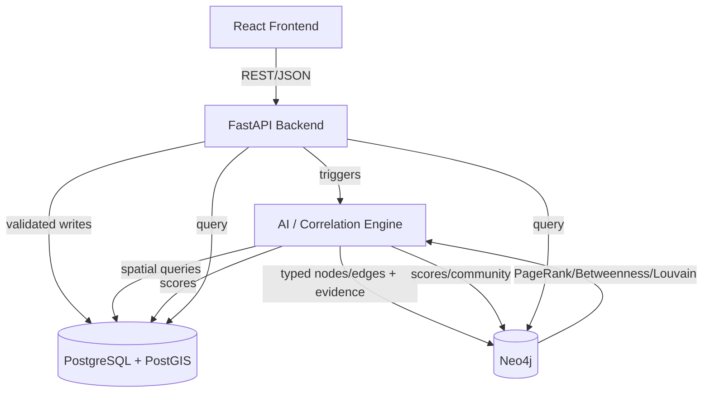
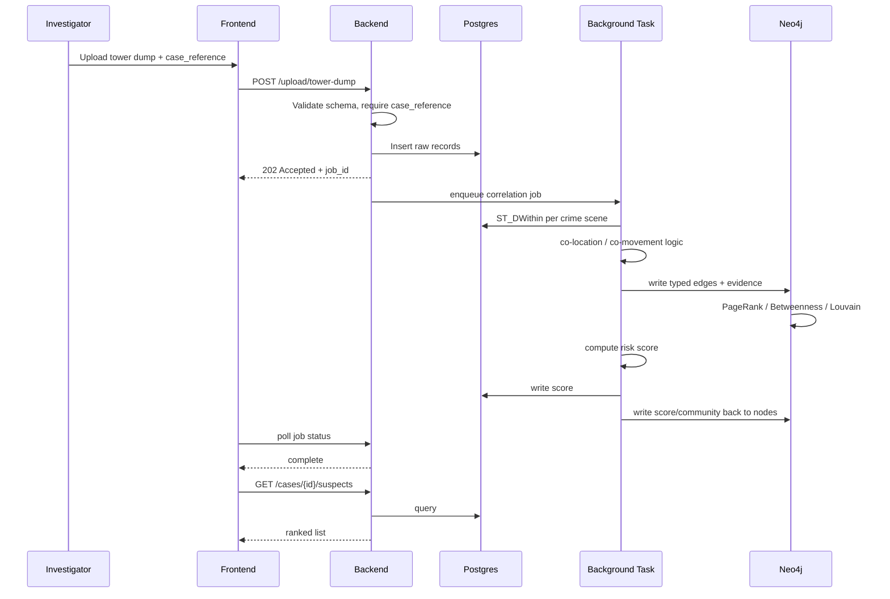
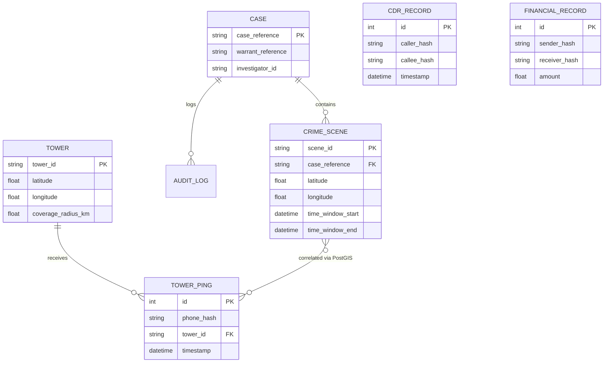
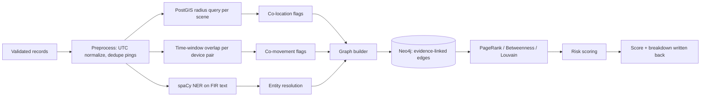

# NEXUS-CRIME — Design Document

Status: draft for hackathon build, architecture intended to survive into a pilot
Owner: dev team
Related: `prd.md`, `blueprint.md`

---

## 1. Overview

NEXUS-CRIME correlates fragmented law-enforcement data — tower dumps, CDRs, financial records, FIR text — into a single relationship graph, scores suspects, and shows investigators why each score exists. The manual version of this work is an investigator cross-referencing spreadsheets by hand. We're automating the cross-referencing step, not the judgment call.

Users are field investigators (upload data, review flagged suspects) and supervising officers (read-only oversight across cases). There's no general public user.

The engineering philosophy is: every flag has to be traceable to a source record, or it doesn't exist. That constraint shapes almost every other decision in this document — it's why we picked rule-based correlation over clustering, a linear scoring formula over a trained model, and a graph database with evidence-bearing edges over a flat "risk score" table. Explainability isn't a feature we bolted on, it's the thing the data model is built around.

---

## 2. Design Goals

| Goal | Why it matters |
|---|---|
| Explainability | Output feeds real investigations. A score with no evidence trail is legally useless and won't survive scrutiny. |
| Offline / on-prem capable | Target deployment is government infrastructure, possibly air-gapped. No architecture decision can assume internet access. |
| Rule-based over ML where possible | We have no labeled outcome data. A rule a person can audit beats a model no one can explain, for this use case. |
| Low operational cost | Free-tier infra, single-node deployment. This is a 2-day build with no budget, and early pilots won't have one either. |
| Modularity | Ingestion, correlation, graph, and presentation are separable so any one of them can be rebuilt without touching the others. |
| Predictable data flow | One direction: upload → validate → correlate → graph → score → visualize. No hidden feedback loops or async surprises. |
| Graceful degradation | Real case data is incomplete (no CDRs, sparse pings). Missing a signal should degrade a score, not break the pipeline. |

---

## 3. Constraints

- **2-day build window.** MVP scope is deliberately narrow (Section 8, PRD). Anything not required for the demo path is cut, not half-built.
- **No real data.** Only synthetic tower dumps / CDRs / FIRs / financial records. Validation is "did we recover the planted network," not "does this generalize."
- **No mandatory external API.** spaCy, PostGIS, Neo4j GDS all run locally. This isn't a preference, it's a deployment requirement — sensitive law-enforcement data can't leave the premises, and a hackathon demo can't depend on network uptime either.
- **Free-tier infrastructure only.** Mapbox free tier, Neo4j Community/AuraDB free, Supabase free as fallback. No paid cloud spend assumed anywhere in the build.
- **Legal gating is non-negotiable.** Every tower-dump processing request requires a case/warrant reference. This is a hard input constraint, not a UX nicety — it maps to a real legal requirement (CrPC/BNSS Section 92 equivalent).
- **No demographic profiling, ever.** Scope constraint on the risk-scoring model, enforced by simply never collecting demographic features, not by a downstream filter.
- **Small team, sequential-buildable.** Module boundaries have to be clean enough that one or two people can build the whole thing serially if the team doesn't split into tracks.

---

## 4. High-Level Architecture

Five subsystems. Frontend never talks to a database directly — everything routes through the API layer, which is also where audit logging happens.

| Subsystem | Responsibility | Talks to |
|---|---|---|
| Frontend (React) | Upload UI, dashboard, map, graph views | Backend API only |
| Backend API (FastAPI) | Validation, orchestration, audit logging | Postgres, Neo4j, AI engine |
| AI engine | NER, correlation, entity resolution, graph writes, scoring | Postgres (read), Neo4j (write) |
| Postgres + PostGIS | Raw records, spatial queries | AI engine, backend queries |
| Neo4j | Relationship graph, centrality/community analytics | AI engine, backend queries |

Why two databases instead of one: PostGIS is the right tool for "which devices were within X meters of this crime scene" — that's a spatial index problem. Neo4j is the right tool for "who is this person connected to, two hops out, and what's the shortest path to a known suspect" — that's a traversal problem. Forcing either problem into the other engine means writing recursive CTEs to fake graph traversal in Postgres, or faking spatial radius queries in Neo4j. Neither is worth it. The cost is a sync boundary (Section 6) which we accept.

---

## 5. Request & Data Flow

Upload is synchronous and fast (validate + write raw record). Correlation is asynchronous — the investigator doesn't wait 30 seconds staring at a spinner on the upload button.

The upload response and the correlation result are decoupled on purpose. If we made upload synchronous end-to-end, a 5,000-row tower dump would hold the HTTP connection open for the full pipeline run, and any correlation bug would turn into a request timeout instead of a background job failure we can log and retry.

---

## 6. Major Design Decisions

### PostgreSQL + PostGIS vs. MongoDB / a single NoSQL store

**Why:** Crime scene ↔ tower ping correlation is fundamentally a radius query (`ST_DWithin`). PostGIS has a mature, indexed implementation of that. It's also relational data with real foreign keys (case → scene → ping), which fights a document model more than it helps it.

**Alternatives considered:** MongoDB with geospatial indexes — works, but loses the FK constraints we actually want (a ping without a valid tower_id should be a write-time error, not a query-time surprise).

**Trade-off:** Schema migrations are more friction than a schemaless store. Acceptable — this data's shape is stable and known upfront.

### Neo4j vs. NetworkX-only

**Why:** Neo4j persists the graph across requests and gives native Cypher path queries ("shortest path between suspect A and B") that we'd otherwise have to hand-roll. It's also the thing that survives a server restart mid-demo.

**Alternatives considered:** NetworkX in-memory only — simpler, zero extra service to run, no Bolt driver, no separate container.

**Trade-off:** Extra moving part in Docker Compose, extra failure mode (GDS plugin misconfiguration is our #1 listed engineering risk). We keep NetworkX as an explicit fallback specifically to de-risk this — if GDS fails to load, centrality/community computation falls back to an in-memory NetworkX pass over the same graph data pulled from Neo4j.

### FastAPI vs. Django

**Why:** We need async background tasks, Pydantic-native validation, and auto-generated OpenAPI docs that the frontend team can code against without waiting on us. Django's synchronous-by-default ORM and heavier app structure don't buy us anything here — there's no admin panel, no template rendering, no monolith-with-everything need.

**Alternatives considered:** Django + DRF — more batteries included, but most of those batteries are dead weight for an API-only backend with two Python people building it in two days.

**Trade-off:** Less "convention over configuration" than Django. We accept that in exchange for less boilerplate around the specific things we need (async I/O, typed request/response models).

### Rule-based correlation and scoring vs. ML clustering / a trained classifier

**Why:** This is the central decision of the whole system. We have no labeled outcome data (no ground truth on "was this person actually involved"), and the output has to be defensible to a legal reviewer, not just accurate on a benchmark. A fixed threshold ("co-located at ≥2 distinct scenes") is auditable by a human reading the rule. A clustering boundary or a classifier's learned decision surface is not, even if it happens to perform better on synthetic data.

**Alternatives considered:** DBSCAN spatiotemporal clustering (would catch fuzzier patterns than fixed time windows); a trained gradient-boosted risk classifier (would likely outperform a hand-weighted linear formula given real labeled data).

**Trade-off:** We're deliberately leaving accuracy on the table. The linear score is fully decomposable in the explainability panel — an investigator can see exactly which of the four terms pushed a suspect's score up. That's the whole point. DBSCAN is documented as a v2 addition specifically *alongside* the rule-based approach, not a replacement — we don't want to lose the auditability floor even as the system gets smarter.

### PostGIS for spatial queries vs. application-level distance calculation

**Why:** `ST_DWithin` uses the GiST spatial index. Doing distance math in Python over every ping/scene pair is O(n×m) with no index, and falls over well before 5,000 records.

**Trade-off:** None really — this one's not close. The only cost is needing the PostGIS extension available, which is why we use the `postgis/postgis` Docker image directly instead of installing the extension by hand under time pressure.

### Offline inference (spaCy, local everything) vs. a cloud LLM for NER/entity extraction

**Why:** A cloud LLM would almost certainly extract entities from FIR text more accurately than spaCy + a gazetteer. But it also means: data leaves the premises, the system stops working without internet, and we introduce a per-request cost and rate limit into a live judged demo. None of those are acceptable for this deployment target.

**Alternatives considered:** Cloud LLM API for NER + summarization.

**Trade-off:** Lower NER accuracy, especially on Indian names/edge-case phrasing not well covered by `en_core_web_sm`. Mitigated (not solved) by the custom gazetteer/regex layer and confidence-threshold gating into a human-review state.

### Background task via FastAPI `BackgroundTasks` vs. Celery/Redis from day one

**Why:** Standing up Redis and a Celery worker inside a 2-day build adds a dependency to debug for zero demo-visible benefit at this data volume. `BackgroundTasks` is enough to decouple the upload response from the pipeline run.

**Trade-off:** No real retry/backoff semantics, no horizontal worker scaling. This is explicitly a "won't survive a real pilot's concurrent-upload load" decision — documented as the first thing to swap out post-hackathon (Section 15).

---

## 7. Component Design

### Ingestion (backend `api/upload/*` + `services/ingestion_service`)
- **Purpose:** Gate everything entering the system behind schema validation and legal authorization.
- **Responsibilities:** Parse multipart uploads, validate against per-type schema, reject malformed rows with specific errors, require `case_reference`, write to Postgres, enqueue correlation.
- **Inputs:** CSV/JSON files, case reference.
- **Outputs:** Validated Postgres rows, a `job_id`.
- **Failure modes:** Malformed schema (reject, don't partially ingest), missing case reference (422, no processing), duplicate `(phone_hash, tower_id, timestamp)` (reject silently-duplicated rows, log count).
- **Dependencies:** FastAPI, Pydantic, SQLAlchemy.
- **Future improvements:** Streaming ingestion instead of full-file upload; async multi-file batch upload.

### Correlation engine (`ai/correlation/*`)
- **Purpose:** Find co-location and co-movement patterns without any ML — pure threshold logic over indexed queries.
- **Responsibilities:** Radius query per crime scene, cross-scene device-set intersection, time-window overlap detection for device pairs.
- **Inputs:** Validated tower pings, crime scene geometry/time windows.
- **Outputs:** Flagged device list (co-location), flagged device-pair list (co-movement), both with cited evidence.
- **Failure modes:** Missing tower metadata (skip that tower, log warning, return partial results — never fail the whole case); sparse ping data (silent false negative, documented limitation, not something we can detect and flag).
- **Dependencies:** PostGIS, Postgres.
- **Future improvements:** DBSCAN as a secondary, fuzzier signal alongside the fixed-threshold rules.

### Entity resolution (`ai/entity_resolution/resolver.py`)
- **Purpose:** Merge name/identifier variants into one node before graph write, without silently merging distinct people.
- **Responsibilities:** RapidFuzz similarity scoring; auto-merge above 90%, route 70–90% to human review, treat below 70% as distinct.
- **Inputs:** Extracted entities from NER + structured identifiers.
- **Outputs:** Resolved entity set, pending-review queue.
- **Failure modes:** False merge on common-surname collisions in the 70–90% band — this is an inherent risk of fuzzy matching at any threshold, not something the review queue eliminates, only mitigates.
- **Dependencies:** RapidFuzz.
- **Future improvements:** Structured-identifier-first resolution (phone hash match) before falling back to fuzzy name matching, to shrink the ambiguous band.

### Graph builder (`ai/graph/builder.py`)
- **Purpose:** The single point where evidence gets permanently attached to a relationship. This is the module the explainability guarantee actually depends on.
- **Responsibilities:** Write typed nodes/edges to Neo4j, attach source evidence array at write time, never write an edge without evidence.
- **Inputs:** Correlation results, CDR/financial records, resolved entities.
- **Outputs:** Neo4j graph.
- **Failure modes:** Duplicate node creation from an unresolved entity variant that slipped past resolution — mitigated by running entity resolution strictly before node creation, never after.
- **Dependencies:** Neo4j Python driver.
- **Future improvements:** Batched writes instead of per-edge writes, once graph size stops being demo-scale.

### Analytics (`ai/graph/analytics.py`)
- **Purpose:** Turn a graph into a ranked list of "who matters here."
- **Responsibilities:** PageRank, Betweenness Centrality, Louvain community detection via GDS; NetworkX fallback if GDS is unavailable.
- **Inputs:** Constructed case subgraph.
- **Outputs:** Per-node centrality score, community ID.
- **Failure modes:** GDS plugin not loaded — falls back to NetworkX transparently, logged, no user-facing error.
- **Dependencies:** Neo4j GDS, NetworkX.
- **Future improvements:** Temporal graph analysis instead of a static per-case snapshot.

### Risk scoring (`ai/scoring/risk_score.py`)
- **Purpose:** Combine every signal into one number an investigator can sort by, without hiding how that number was produced.
- **Responsibilities:** Weighted linear combination (Section 6, PRD formula); proportional reweighting when a signal is missing.
- **Inputs:** Centrality score, co-location count, co-movement count, call/transaction frequency.
- **Outputs:** 0–1 risk score, per-term breakdown.
- **Failure modes:** All signals missing — suspect excluded from ranked list with a logged warning, never silently scored 0 (a 0 looks like "cleared," which is a different and dangerous claim).
- **Dependencies:** None beyond the input signals — pure function, no external calls.
- **Future improvements:** Per-case-type configurable weight profiles (financial crime cases might weight transaction frequency higher).

---

## 8. Data Model

Two stores, two shapes of truth. Postgres owns raw source-of-record data and geometry. Neo4j owns *relationships between entities*, not the entities' raw attributes.

Core relational entities: `Case` (the legal container — everything requires a case_reference), `CrimeScene` (belongs to a case, has geometry + time window), `Tower` (static metadata), `TowerPing` (a device seen at a tower at a time), `CDRRecord`, `FinancialRecord`, `AuditLog` (every query/merge decision, tied to investigator + timestamp).

Neo4j graph shape (not relational, deliberately separate): `Device` and `Person` nodes, connected by `CO_LOCATED_AT`, `CO_MOVED_WITH`, `CALLED`, `TRANSACTED_WITH` edges. Every edge carries a `weight` and an `evidence` array — this is the part of the schema that isn't optional. An edge with an empty evidence array is a bug, not a valid state.

We don't try to keep one canonical "Person" identity resolved across both stores in real time — Postgres identifies people by `phone_hash`, Neo4j resolves `Person` nodes from `Device` nodes only after entity resolution runs. They're consistent at the end of a correlation job, not continuously.

---

## 9. API Design

REST, JSON, versioned under `/api/v1`. Resource-oriented (`/cases/{id}/suspects`, not `/getSuspectsForCase`).

| Concern | Approach |
|---|---|
| Validation | Pydantic schemas on every request body, checked before any DB write |
| Auth | `case_reference` required on all processing endpoints for MVP; full JWT/RBAC deferred, scaffolding present but inactive |
| Errors | Structured error bodies with a specific error code (`MISSING_CASE_REFERENCE`, `INVALID_SCHEMA`, `UNKNOWN_TOWER_ID`), not just an HTTP status |
| Versioning | URI-versioned (`/v1`); breaking changes get a new prefix, we don't mutate response shapes in place |
| Async work | Upload endpoints return `202 Accepted` + `job_id` immediately; correlation results are polled or fetched separately, never returned inline |
| Rate limiting | None at hackathon scale (single-user demo context); flagged as a hard requirement before any multi-tenant deployment |

Endpoint groups: `/upload/*` (write path, one endpoint per data type), `/cases/{id}/*` (read path — suspects, graph, map-data), `/suspects/{hash}/evidence` (explainability), `/health`.

We didn't build a generic `/query` or GraphQL layer. The read patterns are known and small in number (ranked list, graph, map, evidence) — a flexible query layer would be solving a problem we don't have yet.

---

## 10. AI Pipeline

Confidence gating happens twice: once on NER output (below-threshold entities go to human review, not silently dropped or accepted), and once on entity resolution (70–90% similarity band, same treatment). Neither stage has a binary accept/reject — there's always a third "flag for a human" outcome, because a silent auto-accept in either stage corrupts the graph in a way that's hard to detect later.

Explainability isn't a separate stage — it's not a report generated after the fact by querying "what led to this score." Every node/edge write in the graph builder step *includes* its evidence at write time. If we ever find ourselves writing code to reconstruct evidence after the fact, that's a sign the data model got bypassed somewhere and needs fixing at the source, not patched at the presentation layer.

**Known limitations, stated plainly:**
- Tower-based location is cell-level, not GPS-precise. Two devices can show as "co-located" when they're actually a few hundred meters apart within the same tower's coverage radius.
- Synthetic validation proves we recover a *known* planted network. It says nothing about false-positive rates on real, unlabeled data.
- Fuzzy entity resolution can merge two different people with similar names. The review queue catches the cases that land in the ambiguous band — it doesn't catch high-confidence false merges, because there's no signal telling us to look.

---

## 11. Frontend Design

Single-page app, one persistent shell, tabbed views (Dashboard / Map / Graph) rather than separate page navigations — an investigator working a case shouldn't lose context switching views.

**Routing:** `/upload`, `/cases/:caseId/{dashboard,map,graph}`. Dashboard is the default landing tab after a case loads — it's the actionable output, map and graph are exploration tools that support it, not equal siblings.

**State management:** Zustand. Two stores — `caseStore` (active case + cached query results) and `uiStore` (layer toggles, filters). We don't reach for Redux; there's no complex cross-component action pipeline here, just server data plus some view state.

**Dashboard:** Ranked, sortable suspect table is the primary widget. Score breakdown expands per row rather than living on a separate screen — the whole point is that the score isn't a black box, so hiding the breakdown behind a navigation click undercuts the design goal.

**Graph visualization:** Cytoscape.js. Node size maps to centrality, click-to-expand shows evidence. At high node counts we filter by minimum risk score rather than trying to render everything — a fully rendered graph with hundreds of low-relevance nodes is not more informative, it's just slower and noisier.

**Map interaction:** Mapbox GL JS with layer toggles (towers / scenes / suspects) off by default except suspects — showing every tower and every scene by default turns the map into visual noise before the investigator has asked for it.

**Responsive behavior:** Desktop-first, explicitly. This is an investigator workstation tool. We're not building a mobile-first responsive layout for a screen this data-dense — that's a scope decision, not an oversight.

**Loading states:** Skeleton loaders while the background correlation job runs, tied to `job_id` polling — not a generic spinner, because the wait time (up to ~30s) is long enough that a static spinner reads as broken.

---

## 12. Deployment Design

**Local development:** `docker-compose up` brings up Postgres (`postgis/postgis` image — extension pre-installed, no manual `CREATE EXTENSION` step), Neo4j (GDS plugin enabled at container start), backend, frontend. This is also the primary judged-demo deployment path — local-first, specifically to remove network dependency risk during judging.

**Startup order:** Postgres and Neo4j need to be healthy before the backend accepts traffic. Compose health checks gate backend startup; the backend's own `/health` endpoint checks both DB connections and is the thing to hit before starting a demo, not just "did the container start."

**Environment variables:** `.env`, never committed — `DATABASE_URL`, `NEO4J_URI`/`USER`/`PASSWORD`, `MAPBOX_API_KEY`. Frontend gets its own build-time `.env` (`VITE_API_BASE_URL`, `VITE_MAPBOX_TOKEN`) since Vite bakes these in at build, not runtime.

**Production deployment:** Not required for judging. Optional Render/Railway (backend) + Vercel/Netlify (frontend) purely as a shareable pre/post-event link — treated as a convenience, not something the demo depends on.

**Database setup:** Schema applied via Alembic migrations (Postgres) and idempotent Cypher scripts with `CREATE CONSTRAINT IF NOT EXISTS` (Neo4j) — both safe to re-run.

---

## 13. Reliability

| Concern | Approach |
|---|---|
| Error handling | Domain exceptions mapped to specific HTTP codes + error codes, never a bare 500 with no context |
| Logging | Structured log line per pipeline stage transition (ingestion, extraction, correlation, graph write, scoring), each with request ID, timestamp, outcome |
| Health checks | `/health` checks both DB connections; run before every demo session, not just once at deploy |
| Timeouts | DB/Bolt connection timeouts set to 5–10s — a dead container should fail fast, not hang the request |
| Retries | Background task has a basic retry-on-transient-failure pattern documented (e.g., a dropped DB connection mid-job); not required for demo stability, but present so a flaky container doesn't kill a whole case's correlation |
| Recovery | Manual `docker-compose down && up` is the accepted recovery path at this scale — no orchestration layer trying to self-heal |
| Graceful degradation | Missing signal → scoring term excluded and reweighted; GDS down → NetworkX fallback; missing tower metadata → skip that tower, return partial results with a warning in the response, not a failure |

None of this assumes high availability. Single-instance, single-demo-session reliability is the actual bar here — HA is explicitly future scope.

---

## 14. Security

The decisions that matter for this architecture, not a generic checklist:

- **Hashing over encryption for identifiers.** Phone/IMSI numbers are SHA-256 hashed before they ever enter the pipeline. We don't store raw identifiers anywhere in the demo build — there's no "decrypt to view" path to secure, because there's nothing to decrypt. Raw-identifier resolution is explicitly out of scope and would need its own tightly access-controlled service in production.
- **Legal gating as an access control, not just a UX field.** `case_reference` is a hard gate on the upload endpoint, enforced server-side, logged to `AUDIT_LOG` with investigator ID and timestamp. This is standing in for real authorization until full auth exists — it's not decorative.
- **Parameterized queries only, both databases.** SQLAlchemy for Postgres, the Neo4j driver's parameterized Cypher for graph writes. We never string-concatenate user input into a query in either store — this gets called out explicitly because Cypher injection is a less commonly guarded-against pattern than SQL injection, and it's easy to miss in a fast build.
- **No RBAC in MVP.** Every investigator can see every case. This is a known, accepted gap for the hackathon build and the first thing to fix before any pilot — documented, not hidden.
- **No demographic features anywhere near scoring.** This is a scope decision enforced by simply never ingesting demographic data, not a filter applied after the fact to a model that theoretically could use it.

---

## 15. Scalability

| Layer | Scales well because | Bottleneck today |
|---|---|---|
| Postgres/PostGIS | GiST spatial index handles radius queries efficiently well past demo scale | Single instance, no read replicas, no partitioning on `tower_ping` |
| Neo4j | Graph traversal and centrality algorithms are what it's built for | Community Edition, single instance — no clustering, no HA |
| Backend API | Stateless, async request handling | Correlation runs in-process via `BackgroundTasks` — one worker, no queue, no horizontal scale-out |
| Frontend | Static SPA, trivially horizontally scalable behind any CDN | N/A |

The real bottleneck isn't any single database — it's the background task model. `BackgroundTasks` runs in the same process as the API server, with no retry/backoff and no worker pool. Two investigators uploading large tower dumps at the same time will contend for the same process. The documented fix is moving correlation to Celery/RQ + Redis, which is a real architecture change (new service, new failure mode) and shouldn't be treated as a small config swap.

Time-based partitioning of `tower_ping` becomes necessary once record counts move from thousands to millions — real tower dumps can be large, synthetic demo data isn't representative of that scale.

---

## 16. Risks

| Risk | Why it's real | Mitigation |
|---|---|---|
| Graph explosion on a poorly-bounded case | A case with many crime scenes and loose entity resolution thresholds can produce a dense, slow-to-render graph | Filter by minimum risk score before rendering; cap node count client-side |
| Slow spatial queries without the GiST index | Someone drops the index during a schema change and correlation silently gets slow, not wrong | Index creation is part of the reference schema, not an optional migration step |
| Large tower dumps blocking the single background worker | No queue, no worker pool — a big upload can stall other cases' processing | Documented as the top scaling gap (Section 15); not solved in the MVP |
| Concurrent uploads to the same case | Two files landing at once could interleave correlation runs against a partially-written dataset | Correlation job keyed per case; a second job for the same case should wait, not run concurrently — needs explicit locking, currently relies on there being one investigator per case in practice |
| Memory usage on large Cytoscape graphs | Rendering thousands of nodes client-side degrades the browser, not just the API | Same fix as graph explosion — filter before render, never trust the API to hand back a small graph |
| Entity resolution false merges | Fuzzy matching in the 70–90% band is inherently probabilistic | Human review queue catches the flagged band; doesn't catch high-confidence false merges — accepted risk |
| GDS plugin misconfiguration | Neo4j GDS is fiddly to get running correctly under time pressure | NetworkX fallback, but it's a fallback, not a guarantee of identical output — worth testing both paths before a demo, not just the happy path |

---

## 17. Open Questions

- Should ambiguous entity-resolution matches (70–90% confidence) block graph construction until reviewed, or be created provisionally and merged later? Currently provisional — needs a real answer before production, since provisional nodes can leak into a suspect's score before review completes.
- What's the actual mechanism for verifying a case/warrant reference is genuine, rather than just present as a form field? Out of scope for the hackathon, but this is the actual legal control the whole system leans on — needs a real answer before any pilot conversation goes further.
- Are risk-score weights fixed constants or configurable per case/department? Currently fixed. Different case types (financial crime vs. violent crime) plausibly want different weightings, but we have no data yet to justify specific alternate weights.
- Is Neo4j Community Edition sufficient at real operational data volumes, or does a pilot require Enterprise clustering? Needs a capacity-planning pass we haven't done.
- Where does correlation move to when we outgrow `BackgroundTasks`? Celery/RQ + Redis is the assumed answer but hasn't been validated against this specific pipeline's shape.
